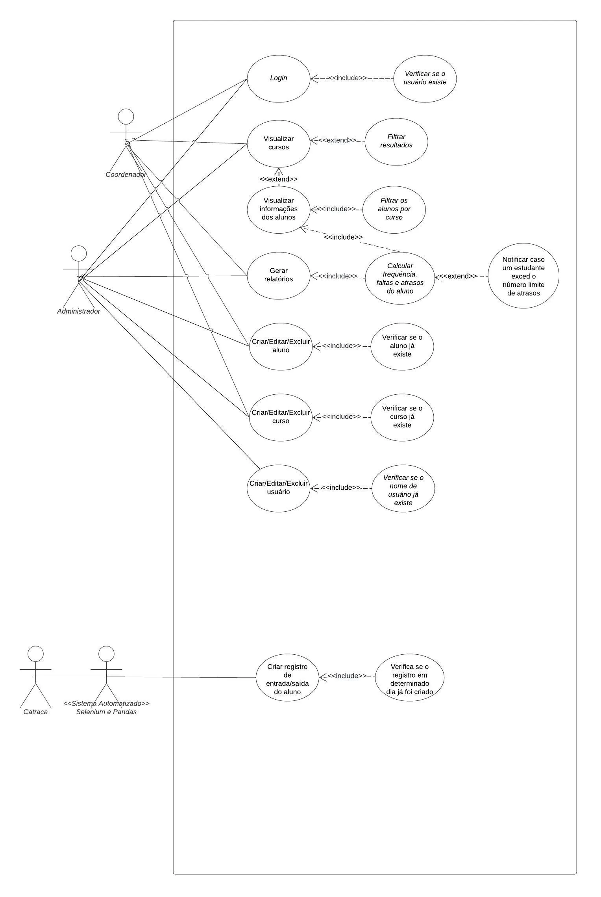

# Senai-Frequency-Control

## <span style="color: #8000FF;">Índice</span>

1. **<span style="color: #9A2EFE;">Introdução</span>**
   - [Sobre a documentação](#sobre-a-documentação)
   - [Problemática](#problemática)
   - [Objetivos](#objetivos)
   - [Justificativa](#justificativa)

2. **<span style="color: #9A2EFE;">Metodologia</span>**
   - [Ferramentas a serem utilizadas](#ferramentas-a-serem-utilizadas)
   - [Linguagens de programação](#linguagens-de-programação)
   - [Linguagens de marcação](#linguagens-de-marcação)
   - [Linguagens de estilo](#linguagens-de-estilo)
   - [Frameworks](#frameworks)
   - [Banco de dados](#banco-de-dados)
   - [Metodologia para desenvolvimento](#metodologia-para-desenvolvimento)

3. **<span style="color: #9A2EFE;">Implementação</span>**
   - [v0.0 - Configuração do ambiente de desenvolvimento](#v00---configuração-do-ambiente-de-desenvolvimento)
   - [v0.1 - Criação do aplicativo](#v01---criação-do-aplicativo)
   - [v0.2 - Criação das URLs e Views](#v02---criação-das-urls-e-views)
   - [v1.0 - Início do desenvolvimento das funcionalidades](#v1.0---Início-do-desenvolvimento-das-páginas)
   - [Temas claro e escuro](#temas-claro-e-escuro)
   - [Elaboração das classes](#elaboração-das-classes)
   - [Lógica de mostrar e esconder senha](#lógica-de-mostrar-e-esconder-senha)

4. **<span style="color: #9A2EFE;">Manual do usuário</span>**
   - [Iniciando](#iniciando)

---

## **<span style="color: #8000FF;">Introdução</span>**

### **<span style="color: #9A2EFE;">Sobre a documentação</span>**
A presente documentação, realizada pelo grupo 03 do Curso Técnico de Desenvolvimento de Sistemas, da instituição SENAI Conde Alexandre Siciliano, da cidade de Jundiaí, visa explicar o funcionamento do Trabalho de Conclusão de Curso “Gestão de Frequência Automatizada: Simplificando a Rotina Administrativa”.

### **<span style="color: #9A2EFE;">Problemática</span>**
Não há dúvidas de que o processo manual na averiguação de frequência dos alunos da instituição SENAI é um tanto cansativo, bem como um desperdício de tempo e esforço. Conforme alunos entram após o horário tolerável, o mesmo recebe um papel de autorização que deve ser assinado por um membro da gestão escolar, a fim de ser permitida a entrada do aluno em sua respectiva sala de aula. Ao entrar, deve-se entregar a autorização ao professor, que verificará a assinatura e, em seguida, guardará o papel.
Levando em conta que uma quantidade considerável de alunos atrasam-se por dia, esse processo toma tempo e esforço dos profissionais envolvidos, bem como interfere no rendimento das aulas conforme o aluno causa a interrupção da explicação do instrutor para entregá-lo o papel.
Não bastasse isso, o desperdício de papéis é outro fator a ser considerado, visto que após o uso, são guardados e, posteriormente, jogados fora.
Os argumentos citados para essa problemática provam que a automação desse procedimento repetitivo é não só benéfica, como também imprescindível.

### **<span style="color: #9A2EFE;">Objetivos</span>**
O objetivo em solucionar este problema visa em automatizar os processos para o gerenciamento de atrasos e faltas de alunos, diminuindo assim o tempo gasto para gerenciá-los, reduzindo o esforço para o registro de falta ou presença, o consumo de papel que seriam gastos com a autorização para a entrada em sala de aula além de diminuir a interferência dos estudantes durante as orientações do instrutor.
Ademais, no sistema, os coordenadores serão notificados caso o estudante atrasar três vezes ou mais, isto apenas caso a entrada seja superior a 10 minutos do horário da ingressão do aluno à instituição. Com isto, eles poderão tomar as devidas medidas necessárias para a resolução do problema com o aluno.
Neste sistema, em cada sala de aula, constará uma lista dos alunos e o nome do responsável da turma, bem como a quantidade dos atrasos, faltas e frequências durante o semestre. Poderá ser gerado um relatório com uma visão geral dos atrasos e frequências durante o período de um ano do curso.
Por fim, consta no sistema uma ferramenta de busca para a pesquisa de salas de **aula e de alunos**, facilitando o acesso rápido e eficiente às informações necessárias para a gestão escolar.
Como passo inicial para o desenvolvimento do projeto, a equipe teve como foco pesquisas relacionadas ao tema, como a geração de relatórios, cálculo de frequência dos alunos, integração do sistema com a catraca, para elaborar as regras de negócio e levantamento de requisitos para que assim, posteriormente, poderíamos desenvolver a etapa de design e desempenho com maior segurança.
Além do objetivo principal de gerenciamento dos atrasos e faltas, foi implementada a lógica para a administração da frequência de alunos, utilizando dados de entrada e saída dos estudantes, estes que são capturados no momento em que sua carteirinha é lida pela catraca, para melhor visualização de seu desempenho de frequência escolar.
Para a etapa de implementação, a primeira meta com maior importância era coletar os dados dos alunos como: nome, turma, id da carteirinha, que estivessem presentes em um documento de pertence da gestão escolar, para que fosse possível relacioná-los com os dados da catraca da instituição, que há informações como o id da matrícula do aluno. Todo este processo de maneira automatizada para que os dados fossem armazená-los em um banco de dados para serem visualizados de forma simplificada ao usuário diretamente no site. ****Todavia, devido às restrições impostas pela Lei Geral de Proteção de Dados (LGPD - Lei 13.709/2018), que tem como objetivo proteger os direitos fundamentais de liberdade, privacidade e o livre desenvolvimento da personalidade da pessoa natural, não foi possível o acesso a essas informações, impactando assim, com o cronograma dos desenvolvedores, tendo sido necessário o replanejamento do roteiro de desenvolvimento. Outro alvo que foi planejado para ser bem desenvolvido, foi colocar em prática as regras de negócio relacionadas à frequência.

### **<span style="color: #9A2EFE;">Justificativa</span>**
A falta de controle da frequência dos alunos tem sido uma preocupação recorrente relatada por professores e coordenadores da instituição SENAI. Muitos alunos atrasados entram no meio das aulas com a autorização da coordenação nas mãos, interrompendo as aulas e causando transtornos. Este problema não só prejudica a concentração e o andamento das aulas, mas também gera uma carga administrativa excessiva para os coordenadores, que precisam lidar com uma grande quantidade de papéis e autorizações manuais.
A situação atual, onde alunos atrasados precisam de autorização manual para entrar na sala, provoca múltiplos problemas:
1. **<span style="color: #4682B4;">Interrupção das Aulas</span>**: Cada vez que um aluno entra na sala atrasado, a aula é interrompida, afetando a concentração de todos e reduzindo o tempo útil de ensino;
2. **<span style="color: #4682B4;">Carga Administrativa</span>**: Coordenadores gastam um tempo significativo tendo que assinar autorizações para a entrada de alunos atrasados, tempo este que poderia ser dedicado a outras tarefas mais produtivas;
3. **<span style="color: #4682B4;">3. Falta de Disciplina</span>**: A ausência de um sistema de controle eficaz incentiva a falta de disciplina entre os alunos, que não enfrentam consequências significativas por seus atrasos frequentes.
4. **<span style="color: #4682B4;">Dificuldade de Monitoramento</span>**: Professores e coordenadores têm dificuldade em monitorar e registrar manualmente todas as ocorrências de atraso e faltas, o que pode levar a uma subestimação do problema e à falta de ações corretivas.
5. **<span style="color: #4682B4;">Comunicação Ineficiente</span>**: Os responsáveis pelos alunos não são prontamente informados sobre a frequência de atrasos, dificultando o acompanhamento e a intervenção necessária para corrigir o comportamento dos estudantes.
Este sistema permitirá que a gestão monitore os atrasos e a frequência dos alunos de maneira mais eficaz, diminuindo esforços manuais e simplificando a rotina administrativa. A implementação dessas estratégias melhorará significativamente a comunicação interna e a solução de problemas de forma eficiente.

### **<span style="color: #9A2EFE;">Observação</span>**
Durante as primeiras etapas de desenvolvimento, os desenvolvedores passaram por uma mudança de planos inesperada e fora de seu controle, vinda de um esclarecimento sobre o projeto com a Analista de Qualidade de Vida. O referido processo evidenciou as limitações organizacionais concernentes ao acesso e processamento dos dados referentes à movimentação dos estudantes no sistema de controle de acesso. Consequentemente, houve a reposição estratégica para dar continuidade ao projeto, fundamentando a abordagem nas modificações identificadas.

---

## **<span style="color: #8000FF;">Metodologia</span>**

### **<span style="color: #9A2EFE;">Ferramentas utilizadas</span>**
- **<span style="color: #4682B4;">Trello:</span>** É um aplicativo de gerenciamento de projeto baseado na web;
- **<span style="color: #4682B4;">Visual Studio Code:</span>** É um editor de código-fonte desenvolvido pela Microsoft para Windows, Linux e macOS. Ele inclui suporte para depuração, controle de versionamento Git incorporado, realce de sintaxe, complementação inteligente de código, snippets e refatoração de código. Utilizamos a versão 1.91.1-x64;
- **<span style="color: #4682B4;">Git:</span>** É um sistema de controle de versões distribuído, usado principalmente no desenvolvimento de software, mas pode ser usado para registrar o histórico de edições de qualquer tipo de arquivo. Utilizamos a versão 2.46.0-x64;
- **<span style="color: #4682B4;">HostGator:</span>** É um provedor de hospedagem compartilhada, revendedor, virtual privado e hospedagem dedicada;
- **<span style="color: #4682B4;">Figma:</span>** É um editor gráfico de vetor e prototipagem de projetos de design baseado principalmente no navegador web, com ferramentas offline adicionais para aplicações desktop para GNU/Linux, macOS e Windows.

### **<span style="color: #9A2EFE;">Linguagens de Programação</span>**

### **<span style="color: #9A2EFE;">Python v3.12.3</span>**
Python é uma linguagem de programação versátil, conhecida por sua simplicidade e facilidade de aprendizado. Ela é interpretada, ou seja, o código é executado linha por linha, o que facilita o teste e a depuração. Além disso, a linguagem é orientada a objetos, o que permite uma melhor organização do código em estruturas reutilizáveis. 
A linguagem é uma das mais populares do mundo e é amplamente utilizada em diversos setores, como desenvolvimento web, ciência de dados e inteligência artificial, garantindo uma variedade de recursos - incluindo documentação, tutoriais e fóruns – que ajudam a aprimorar as habilidades dos desenvolvedores.
No nosso sistema, Python foi essencial para construir o back-end (parte interna de uma aplicação) utilizando Django, um framework que facilitou o desenvolvimento das lógicas de cadastro e login de coordenadores, uploads de dados de frequência, alunos e dos cursos fornecidos pela instituição, bem como a implementação das funcionalidades de notificação automática. Além disso, a linguagem foi utilizada para a coleta de informações do banco de dados para a listagem dos alunos e cursos, por exemplo, nas páginas de visualização.

### **<span style="color: #9A2EFE;">JavaScript</span>**
JavaScript é uma linguagem de programação interpretada e orientada a objetos, frequentemente usada para desenvolver interatividade em páginas web. Ela permite que os desenvolvedores controlem o comportamento dos elementos na tela, respondendo a eventos como cliques e movimentos do mouse. Suas capacidades dinâmicas incluem a criação de objetos em tempo real e a manipulação de funções.
A linguagem é executada no cliente web ou pode ser usada para projetar e/ou programar o comportamento de páginas web quando ocorrem eventos.
Neste projeto, o JavaScript foi utilizado para implementar mudanças de estado, como a alternância entre temas claro e escuro, amostragem e ocultação de senhas em formulários, e a funcionalidade da barra de pesquisa, proporcionando uma experiência mais interativa e amigável ao usuário.

### **<span style="color: #9A2EFE;">Linguagens de Marcação</span>**

#### **<span style="color: #AC58FA;">HTML 5</span>**
A Linguagem de Marcação de Hipertexto (HTML) é uma linguagem utilizada na construção de páginas na Web, podendo ser interpretada por navegadores. O HTML não é considerado uma linguagem de programação, já que ele não pode criar funcionalidades dinâmicas. Ao invés disso, com o HTML, os usuários podem criar e estruturar seções, parágrafos e links usando elementos, tags e atributos. No projeto, ela foi utilizada em todo o front-end (parte visual do site) para a estruturação das páginas web.

### **<span style="color: #9A2EFE;">Linguagens de Estilo</span>**

#### **<span style="color: #AC58FA;">CSS</span>**
Cascading Style Sheets ou Folhas de Estilo em Cascata, é um mecanismo para adicionar estilos a uma página web, aplicado diretamente nas tags HTML ou ficar contido dentro das tags `<style>`. Também é possível adicionar estilos adicionando um link para um arquivo CSS que contém os estilos.

### **<span style="color: #9A2EFE;">Frameworks</span>**

#### **<span style="color: #AC58FA;">Bootstrap</span>**
O Bootstrap é um framework front-end e de código-fonte aberto, que disponibiliza componentes prontos para utilização, ganhando muita produtividade no desenvolvimento. Ele oferece uma coleção de elementos prontos, como botões, tabelas e formulários, que podem ser facilmente utilizados e personalizados. O framework segue os princípios de usabilidade e tendências de design para interfaces. Além disso, sua padronização permite que os sites obtenham uma aparência atraente.

#### **<span style="color: #AC58FA;">Django</span>**
O Django é um framework web Python de código aberto, no qual destaca-se por oferecer um ambiente simplificado para a criação de soluções web escaláveis, além proporcionar ferramentas robustas e eficientes aos desenvolvedores, dispensando a necessidade de reescrever códigos comuns a todos os projetos web em Python. Ele disponibiliza, portanto, uma estrutura pré-configurada e bibliotecas com código pronto, melhorando a produtividade e organização do desenvolvimento.
O framework utiliza a arquitetura  MVT *(Model-View-Template)*, representando respectivamente, a lógica de negócios, a lógica de rederização e a de exibição da interface do usuário, facilitando a criação de aplicações e promovendo a separação das atividades e reutilização de partes do código. Essa abordagem é uma variação do tradicional padrão MVC *(Model-View-Controller)*, amplamente adotada em diversos frameworks e sistemas.
Além disso, esta estrutura prioriza a segurança, oferecendo recursos projetados para impedir ameaças como CSRF, XSS e SQL Injections. Também conta com proteções como validação automática de formulários e gerenciamento de autenticação, entre outros serviços.
Com a implementação do mapeamento “Objeto-Relacional”, o Django permite a interação do banco de dados através de classes e objetos Python, eliminando a necessidade de escrita SQL direta. Isso não apenas simplifica o acesso aos dados, mas também reduz os riscos de segurança e, ao mesmo tempo, melhora a legibilidade do código. Além disso, a estrutura facilita o mapeamento de URLs, vinculando *URLs* específicos às suas *View* correspondentes dentro dos aplicativos. Essa abordagem organizada direciona as solicitações do usuário para as seções apropriadas do código e agiliza a criação de URLs que são semânticos e fáceis de usar, melhorando, em última análise, a experiência do usuário e otimizando o desempenho do mecanismo de pesquisa.
O Django disponibiliza um painel administrativo pronto para uso, facilitando o gerenciamento de dados da aplicação, sendo gerado de forma automática a partir dos modelos definidos no projeto, além de vários outros recursos, sendo um framework completo sem a necessidade de recorrer a soluções externas.

### **<span style="color: #9A2EFE;">Bibliotecas</span>**

#### **<span style="color: #AC58FA;">Selenium</span>**
O Selenium é uma ferramenta para automatizar navegadores, usada especialmente para testes e aplicações web, permitindo a simulação de interações de usuários, como cliques e 18 preenchimento de formulários, garantindo que funcionalidades funcionem corretamente em diferentes navegadores e plataformas.
A biblioteca facilita a execução de testes repetitivos e de regressão, garantindo que novas alterações não afetem funcionalidades existentes.
Neste sistema, a biblioteca foi utilizada para o desenvolvimento da lógica para automatização da extração dos dados da catraca para serem salvos no banco de dados PostgreSQL, evitando erros manuais e economizando tempo.

#### **<span style="color: #AC58FA;">PyAUtoGUI</span>**
O PyAutoGUI é uma biblioteca Python que permite automatizar a interação com a Graphical User Interface, ou Interface Gráfica do Usuário em português (GUI) do seu computador, podendo controlar o mouse, teclado, entre outros elementos visuais da tela, diferente do Selenium, que é focado exclusivamente em navegadores web.

O Selenium e o PyAutoGUI foram utilizados em conjunto para automatizar a coleta de dados da catraca e armazená-los no banco de dados PostgreSQL. Enquanto o Selenium focou na extração automatizada de dados por meio de navegação web, o PyAutoGUI foi essencial para interagir com a interface gráfica da máquina, controlando elementos visuais fora do navegador, como ações que não poderiam ser realizadas apenas via web. Essa combinação permitiu uma integração completa, eliminando erros manuais e garantindo a precisão dos dados coletados e armazenados.
#### **<span style="color: #AC58FA;">ReportLab</span>**
ReportLab é uma biblioteca para softwares que permite criar e gerar relatórios no formato desenvolvido pela empresa Adobe Incorporated conhecido como PDF (Portable Document Format). A biblioteca foi planejada para ser executada especialmente na linguagem Python, usando as fontes disponibilizadas pelas Fontes TrueType, disponibilizadas pela Apple Computer, em parceria com a Microsoft.

O uso da biblioteca ReportLab foi de extrema importância para a lógica de geração de relatórios referentes aos maiores atrasos e faltas do sistema, uma vez que disponibiliza diversas funções para estilização e estruturação de documentos em PDF.

#### **<span style="color: #AC58FA;">Schedule v1.2.2</span>**
Schedule é uma biblioteca para Python que possibilita executar códigos em horários específicos. Esta ferramenta foi utilizada para definir os horários de execução do código que automatiza a coleta de dados das catracas.

#### **<span style="color: #AC58FA;">Pandas v2.2.3</span>**
Pandas é uma biblioteca de manipulação e análise de dados, criada especialmente para Python, e foi utilizada para manipular os Arquivos de Texto (TXT) e Comma Separated Values (CSV) que armazenam os dados obtidos referentes às frequências.


### **<span style="color: #9A2EFE;">Banco de dados</span>**

#### **<span style="color: #AC58FA;">PostgreSQL</span>**
Escolher o PostgreSQL como banco de dados para este sistema de gerenciamento de atrasos e frequência traz diversas vantagens que garantem a eficiência e a robustez do projeto.
Primeiramente, o PostgreSQL é conhecido por seu alto desempenho e escalabilidade, o que é essencial para lidar com o grande volume de dados gerados pelo sistema, incluindo registros de entrada e saída dos alunos, onde o banco de dados cresce juntamente com o aumento da quantidade de alunos ou de informações armazenadas, sem comprometer a performance.
Além disso, o PostgreSQL oferece suporte a uma ampla gama de tipos de dados, o que permite a realização de consultas complexas, possibilitando a criação de relatórios detalhados e análises aprofundadas do comportamento dos alunos, algo crucial para o acompanhamento de frequência e atrasos.
Outro ponto forte é a conformidade do PostgreSQL com o modelo ACID (Atomicidade, Consistência, Isolamento, Durabilidade), garantindo a integridade e segurança dos dados, protegendo informações sensíveis.
Por fim, a integração nativa com Django, o framework utilizado no desenvolvimento do projeto, facilita a implementação do PostgreSQL, aproveitando ao máximo suas funcionalidades avançadas.
Essas características fazem do PostgreSQL uma escolha sólida e eficiente para o sistema de gerenciamento de atrasos, oferecendo uma base confiável e segura para o projeto.

### **<span style="color: #9A2EFE;">Outras Ferramentas</span>**

#### **<span style="color: #AC58FA;">Agendador de Tarefas V1.0</span>**
O Agendador de Tarefas é um programa disponibilizado pelo Windows que permite automatizar atividades repetitivas, bem como executar ações em um horário previamente especificado.
Para realizar o agendamento automático para executar o código que obterá o arquivo contendo os dados extraídos das catracas, optou-se pela utilização do Agendador de Tarefas do Windows, que, ao criar a tarefa, define informações básicas como nome, com qual condição será iniciada a tarefa e sua data de início, horário e dia específicos que ela será executada.

#### **<span style="color: #AC58FA;">Dependencias do Projeto</span>**

```python
attrs==24.2.0
certifi==2024.8.30
cffi==1.17.1
decouple==0.0.7
h11==0.14.0
idna==3.10
MouseInfo==0.1.3
outcome==1.3.0.post0
psycopg2==2.9.10
PyAutoGUI==0.9.54
pycparser==2.22
PyGetWindow==0.0.9
PyMsgBox==1.0.9
pyperclip==1.9.0
PyRect==0.2.0
PyScreeze==1.0.1
PySocks==1.7.1
python-dotenv==1.0.1
pytweening==1.2.0
schedule==1.2.2
selenium==4.25.0
sniffio==1.3.1
sortedcontainers==2.4.0
trio==0.27.0
trio-websocket==0.11.1
typing_extensions==4.12.2
urllib3==2.2.3
websocket-client==1.8.0
wsproto==1.2.0
```

### **<span style="color: #9A2EFE;">Metodologia para o Desenvolvimento</span>**
Traduzido do inglês, Scrum é uma estrutura ágil de colaboração em equipe comumente usada no desenvolvimento de software e em outros setores. O Scrum prescreve que as equipes dividam o trabalho em metas a serem concluídas dentro de iterações com limite de tempo, chamadas sprints. Para desenvolver o projeto, fizemos a utilização da metodologia ágil Scrum, que nos permitiu organizar o trabalho em sprints curtos e interativos, garantindo entregas contínuas e adaptáveis.

---

## **<span style="color: #9A2EFE;">Levantamento de Requisitos</span>**

### **<span style="color: #AC58FA;">Requisitos Funcionais</span>**
- **<span style="color: #8000FF;"> [RF001] - Acesso ao software onde constam os dados de cada catraca**</span> 
    (informações de saída e entrada de alunos, data, horário e identificador único da carteirinha).
    - **Prioridade:** Alta.
    - **Descrição:** Permitir que os usuários autorizados acessem os dados das catracas, que registram as entradas e saídas dos alunos, com informações como data, horário e identificador único da carteirinha.
    - **Regras de Negócio:** O acesso deve ser restrito a usuários autorizados.
    - **Restrições Tecnológicas:** Deve ser compatível com o sistema de catracas existente.
    
- **<span style="color: #8000FF;">[RF002] - Exportação automática dos dados em horários determinados e unificação em um único banco de dados.**</span>
    - **Prioridade:** Alta.
    - **Descrição:** O sistema deve exportar automaticamente os dados das catracas em horários pré-definidos e consolidá-los em um banco de dados.
    - **Regras de Negócio:** A exportação deve ocorrer sem intervenção manual.
    - **Restrições Tecnológicas:** O sistema deve suportar agendamento de tarefas automáticas.
    
- **<span style="color: #8000FF;"> [RF003] - (Requisito descontinuado em 10/09) Acesso às informações da carteirinha de cada aluno para verificação de presença.** </span>
    - **Prioridade:** Alta.
    - **Descrição:** Permitir que os dados das carteirinhas dos alunos sejam utilizados
    para verificar a presença com base nos registros das catracas.
    - **Regras de Negócio:** A verificação deve ser precisa e em tempo real.
    - **Restrições Tecnológicas:** Integração com o sistema de gestão de carteirinhas.

- **<span style="color: #8000FF;">[RF004] - Notificação à gestão em caso de aluno com mais de 3 atrasos.**</span>
    - **Prioridade:** Alta.
    - **Descrição:** O sistema deve enviar notificações automáticas à gestão se algum aluno acumular mais de três atrasos.
    - **Regras de Negócio:** A notificação deve ser enviada de forma automática e
    imediata.
    - **Restrições Tecnológicas:** O sistema deve ser capaz de gerar e enviar
    notificações automáticas.

- **<span style="color: #8000FF;"> [RF005] - Geração de relatórios sobre atrasos.**</span>
    - **Prioridade:** Média.
    - **Descrição:** O sistema deve gerar relatórios que indiquem os alunos com mais e menos atrasos e faltas, além da porcentagem em um período determinado.
    - **Regras de Negócio:** Os relatórios devem ser precisos e acessíveis à gestão.
    - **Restrições Tecnológicas:** Deve permitir a exportação dos relatórios em formato
    PDF.
    
- **<span style="color: #8000FF;"> [RF006] - Ferramenta de busca de salas de aula e alunos.**</span>
    - **Prioridade:** Média.
    - **Descrição:** O sistema deve permitir a busca eficiente por salas de aula e alunos, exibindo dados relevantes como nome do estudante, instrutor responsável e quantidade de atrasos.
    - **Regras de Negócio:** A ferramenta de busca deve ser rápida e responsiva.
    - **Restrições Tecnológicas:** Integração com o banco de dados.
    
- **<span style="color: #8000FF;"> [RF007] - Lógica de autenticação e permissões.**</span>
    - **Prioridade:** Alta.
    - **Descrição:** Implementar uma lógica robusta de autenticação e autorização, permitindo que coordenadores adicionem, atualizem e excluam salas de aula e alunos.
    - **Regras de Negócio:** Apenas usuários autorizados podem realizar alterações.
    - **Restrições Tecnológicas:** Deve usar protocolos de segurança modernos.
    
- **<span style="color: #8000FF;"> [RF008] - Acesso às informações da carteirinha dos alunos do Grupo 03 (desenvolvedores) para demonstração de verificação de presença.**</span>
    - **Prioridade:** Alta
    - **Descrição:** Permitir que os dados das carteirinhas dos alunos sejam utilizados para verificar a presença com base nos registros das catracas.
    - **Regras de Negócio:** A verificação deve ser precisa e em tempo real.
    - **Restrições Tecnológicas:** Integração com o sistema de gestão de carteirinhas.
    

### **<span style="color: #9A2EFE;">Requisitos Não Funcionais</span>**

- **<span style="color: #8000FF;"> [RNF001] - Acesso restrito à rede ADM (catraca).**</span>
    - **Prioridade:** Alta
    - **Descrição:** O sistema deve ser acessível apenas pela rede interna da instituição para garantir segurança e integridade dos dados.
    - **Regras de Negócio:** O acesso fora da rede ADM deve ser bloqueado.
    - **Restrições Tecnológicas:** Implementação de firewall e restrições de rede.

- **<span style="color: #8000FF;"> [RNF002] - Segurança contra invasões e vazamento de dados.**</span>
    - **Prioridade:** Alta
    - **Descrição:** Implementar medidas de segurança avançadas para proteger o sistema contra-ataques e vazamentos de dados.
    - **Regras de Negócio:** A segurança deve ser auditada regularmente.
    - **Restrições Tecnológicas:** Implementação de criptografia de dados e monitoramento de segurança.

- **<span style="color: #8000FF;"> [RNF003] - Design interativo e organizado.**</span>
    - **Prioridade:** Média
    - **Descrição:** O sistema deve ter uma interface amigável, com design interativo e bem-organizado, facilitando a navegação e uso pelos usuários.
    - **Regras de Negócio:** O design deve seguir as diretrizes de usabilidade.
    - **Restrições Tecnológicas:** Compatibilidade com diferentes dispositivos e navegadores.
    
- **<span style="color: #8000FF;"> [RNF004] - Código comentado e documentação.**</span>
    - Prioridade: Média
    - Descrição: O código do sistema deve ser bem comentado e acompanhado de documentação clara, facilitando a manutenção e futuras atualizações.
    - Regras de Negócio: A documentação deve ser mantida atualizada com as mudanças no sistema.
    - Restrições Tecnológicas: A documentação deve ser acessível a todos os
    membros da equipe de desenvolvimento.

### <span style="color: #9A2EFE;">**Diagrama de Caso de Uso**</span>

No Diagrama de Caso de Uso apresentado, são representadas as interações entre diferentes atores (usuários do sistema) e as funcionalidades disponíveis no projeto desenvolvido, destacando a relação entre ações e dependências. A seguir, está uma descrição detalhada de cada elemento.

### <span style="color: #AC58FA;">**Atores**</span>
Os atores são os usuários que interagem com o sistema, podendo ser uma pessoa, uma organização ou um sistema externo que interage com seu aplicativo ou sistema. Eles devem ser objetos externos que produzam ou consumam dados. A seguir, está uma descrição dos atores presentes no Modelo de Caso de Uso.
- **Coordenador:** Responsável por gerenciar usuários e realizar atividades relacionadas à frequência e atrasos dos alunos.
- **Administrador:** Atua na administração geral do sistema, incluindo a criação e manutenção de usuários, cursos e alunos.
- **Catraca (Sistema Automatizado):** Representa o sistema que fornece registros de entrada e saída dos alunos. Integra ferramentas como Selenium e Pandas para automação de processos.

### <span style="color: #AC58FA;">**Relacionamentos**</span>
Em um Diagrama de Casos de Uso, tanto a inclusão quanto a extensão e associação, são relacionamentos que descrevem como diferentes casos de uso interagem ou se relacionam entre si. A seguir, está a explicação de como cada interação funciona:
- **Inclusão (include):** a inclusão é usada para mostrar que um caso de uso sempre incorpora ou "inclui" o comportamento de outro caso de uso. É como se o caso de uso principal delegasse parte de seu comportamento a um caso de uso incluído.
- **Extensão (extend):** a extensão é usada para mostrar que um caso de uso estende o comportamento de outro caso de uso sob certas condições. Isso significa que o comportamento do caso de uso original pode ser expandido por outro caso de uso opcional, dependendo de uma condição específica.
- **Associação:** uma associação é um relacionamento entre um ator e um caso de uso de negócios. Indica que um ator pode usar a funcionalidade do sistema de negócios. Ela é uma é representada como uma linha que liga os elementos a serem relacionados.

### <span style="color: #AC58FA;">**Casos de Uso**</span>
Os casos de uso, sendo apresentados de forma visual pelo formato oval na horizontal, representam os diferentes usos que um usuário pode ter, ou seja, são as funcionalidades do sistema. A seguir, será fornecida uma explicação de cada caso de uso, citando também quais usuários podem acessá-los:

### <span style="color: #AC58FA;">**Casos de Uso do Coordenador e Administrador:**</span>
- **Login:** permite que tanto o coordenador quanto o administrador acessem o sistema. O caso de uso possui uma relação de inclusão com o caso de uso “verificar a existência do usuário”, onde as credenciais fornecidas são verificadas. Se as credenciais corresponderem a um usuário cadastrado, o acesso é concedido; caso contrário, uma mensagem de erro é exibida.
- **Criar, Editar e Excluir Curso ou Aluno:** tanto o coordenador quanto o administrador podem adicionar novos cursos e alunos ao sistema. Contudo, as funcionalidades de edição e exclusão é exclusiva ao administrador, podendo apenas ele, gerenciar tais funções, a fim de garantir um maior controle sobre as modificações.
Além disso vale destacar que, para executar os processos mencionados, é realizada uma verificação prévia da existência do curso ou aluno em questão. Essa validação é feita pelos casos de uso “verificar se o curso já existe” e “verificar se o aluno já existe”.
- **Visualizar Cursos:** tanto o coordenador quanto o administrador podem visualizar uma lista completa de todos os cursos cadastrados, contendo informações de nome, código da turma e responsável. Esse caso de uso, tem relações de extensão com os casos de visualização dos alunos, onde é apresentada as informações de cada um, e o de filtragem de resultados, sendo uma ferramenta de busca.
- **Filtrar Resultados:** permite que tanto o coordenador quanto o administrador, filtrem a visualização de informações, sendo uma ferramenta de busca para pesquisar um determinado curso.
- **Visualizar Informações dos Alunos:** apresenta ao coordenador uma lista detalhada de informações sobre os alunos, incluindo frequência, faltas e atrasos registrados, com base no caso de uso “calcular frequência, faltas e atrasos do aluno” e “filtrar os alunos por curso”, tendo uma relação de inclusão entre ambos.
- **Calcular Frequência, Faltas e Atrasos:** é uma consulta no banco de dados para efetuar os cálculos relacionados ao desempenho de frequência dos alunos, baseando-se nos registros de entrada e saída e nas regras definidas para atrasos e faltas. Tal caso de uso tem um relacionamento do tipo extensão com o caso de uso de “notificações”, que notifica o coordenador e o administrador caso um aluno exceda a quantidade limite de atrasos.
Além disso, ele tem uma relação de inclusão com os casos de uso de “visualização das informações dos alunos” e de “geração de relatório”, pois ambas as funcionalidades exigem o cálculo do desempenho acadêmico do estudante.
- **Notificação:** envia alertas automáticos tanto ao coordenador quanto ao administrador quando um aluno excede o limite de atrasos. Esse recurso é um caso de uso opcional, sendo o relacionamento extensão, acionado em situações específicas.
- **Filtrar os Alunos por Curso:** é uma funcionalidade cuja responsabilidade é de “filtrar os alunos por turma”.
- **Gerar Relatórios:** tanto o coordenador quanto o administrador podem gerar documentos em formato PDF com informações sobre frequência, atrasos e faltas dos alunos com pior desempenho. Os relatórios são uma ferramenta essencial para as análises.
- **Criar, Editar e Excluir Usuário:** somente o administrador possui acesso a essas funcionalidades, que ao efetuar alguma, ocorre a verificação se o usuário já existe ou não.
Ademais, é importante destacar que a edição de informações só pode ser realizada através da rota “/admin”, pois o sistema não conta com uma lógica específica para permitir esse tipo de modificação. Além disso, para todos os casos de uso explicados anteriormente, é necessária a autenticação do usuário no sistema.

### <span style="color: #AC58FA;">**Casos de Uso do Sistema Automatizado (Catraca):**</span>
- **Criação de Registro de Entrada e Saída:** a integração com a catraca permite capturar registros de entrada e saída de alunos de forma automática. Isso inclui o uso de ferramentas como Selenium e PyAutoGUI para processar os dados rapidamente.
- **Validação de Registros:** antes de armazenar as informações capturadas, o sistema valida os registros para garantir que estão completos e corretos. Essa validação previne erros que possam impactar relatórios ou cálculos. Além do mais, esse caso de uso está incluído ao de criação de registro de entrada e saída do estudante.

Com o detalhamento do Diagrama de Caso de Uso apresentado, torna-se mais fácil a compreensão de como o sistema funciona de forma geral, proporcionando uma visão mais clara de suas funcionalidades e interações.

---

## <span style="color: #9A2EFE;">**Design do Sistema**</span>
### <span style="color: #AC58FA;">**Casos de Uso do Sistema Automatizado (Catraca):**</span>
A arquitetura MTV significa Model-Template-View, e é um padrão de design de software para projetos que utilizam o framework Django. A seguir, o diagrama representa visualmente o funcionamento da arquitetura deste framework:

A seguir, está uma descrição de cada camada que estão presentes na arquitetura MTV:
- **Model:** responsável pelo mapeamento do banco de dados, que possui uma comunicação direta com ele. As Models estão contidas no arquivo *models.py*.
- **Template:** pasta que conterá os arquivos .html para as páginas do sistema. Receberá das Views os dados que aparecerão no front-end do sistema.
- **View:** onde é feita a lógica de negócio. Receberá os dados do app da Model e mandará para os Templates. As Views são as funções presentes no arquivo *views.py*.
As setas sólidas representam uma relação direta entre os componentes do diagrama, enquanto a seta pontilhada representa uma relação menos direta. Duas setas presentes no diagrama possuem duas pontas, o que significa uma comunicação entre os dois componentes.

### <span style="color: #AC58FA;">**Diagrama de Classes**</span>
Um Diagrama de Classes é uma representação gráfica amplamente utilizada na engenharia de software para descrever a estrutura estática de um sistema, representando suas classes, atributos, métodos e os relacionamentos entre elas. Este tipo de diagrama segue o padrão UML (Unified Modeling Language ou Linguagem de Modelagem Unificada), que é amplamente utilizado para a padronização de modelagem e documentação de sistemas de software. A seguir, o diagrama representa visualmente o funcionamento da estrutura do sistema:

No Diagrama de Classes apresentado, estão representadas as entidades fundamentais do sistema, destacando seus atributos, métodos e os tipos de relacionamento entre as classes, como associação, agregação, composição e herança.
As classes são os elementos básicos de um Diagrama de Classes, representando abstrações de objetos do mundo real ou conceitos relacionados ao sistema. Cada classe é descrita com seus atributos (dados que ela armazena) e métodos (operações que ela realiza). A seguir, está uma descrição das classes presentes no diagrama:
- **Usuario:** representa os usuários que possuem acesso ao sistema, como coordenadores e administradores. Inclui atributos como nome, sobrenome, username e cargo.
- **Aluno:** representa os estudantes registrados no sistema. Seus atributos incluem informações como nome, id_carteirinha e id_curso.
- **Frequencia:** representa a classe responsável por armazenar os registros vindos da catraca, com atributos como id, id_aluno, data, hora e identificador (1 ou 2, entrada ou saída, respectivamente).
- **Curso:** representa os cursos disponíveis na instituição. Contém atributos como turma, nome_curso, horario_entrada, horario_saida, carga_horaria, responsavel, dias_funcionamento, data_inicio, data_fim, carga_horaria_intervalo e dias_letivos.
Os relacionamentos entre classes em um Diagrama de Classes são fundamentais para entender a estrutura e as interações do sistema. Os principais tipos de relacionamentos presentes incluem:
- **Relacionamento entre Aluno e Curso:** cada aluno está vinculado a apenas um curso, utilizando a chave estrangeira id_curso na classe Aluno para referenciar a classe Curso. Por outro lado, um curso pode estar associado a vários alunos (0..* para Aluno e 1 para Curso).
- **Relacionamento entre Aluno e Frequência:** um aluno pode ter vários registros de frequência, mas cada registro está associado a um único aluno, representado pela chave estrangeira id_aluno na classe Frequência (1 para Aluno e 0..* para Frequência).

## <span style="color: #9A2EFE;">**Páginas**</span>
### <span style="color: #AC58FA;">**Página Inicial**</span>
A página inicial conta com uma barra de navegação localizada no topo, onde a logo do SENAI está posicionada no lado esquerdo e, no lado direito, encontra-se um componente padrão: um botão para troca de tema, permitindo a alternância da coloração da página entre os temas claro e escuro. No conteúdo principal, há um texto com o título da página e um botão que redireciona o usuário para a página de Login.
<p align="center" style="display: flex; justify-content: center; gap: 10px;">
  
  
</p>

### <span style="color: #AC58FA;">**Página de Login**</span>
Após o redirecionamento para a página de Login, o usuário deve inserir seus dados, como username e senha. Ao lado do campo de senha, há um ícone que permite exibir ou ocultar a senha, alterando sua aparência de acordo com a ação: um olho riscado quando a senha está visível e um olho aberto quando ela está oculta. Caso os dados sejam inseridos corretamente e o botão de Login seja clicado, o usuário será redirecionado para a página de Cursos. No entanto, se houver erro nos dados fornecidos, será exibida a mensagem: “Nome de usuário ou senha incorretos”.
<p align="center" style="display: flex; justify-content: center; gap: 10px;">
  
  
</p>

### <span style="color: #AC58FA;">**Página de Cursos**</span>
Após a realização do Login, o usuário é redirecionado para a página de Cursos. A barra de navegação, presente em todas as páginas, passa a ser exibida. Após o Login, uma mensagem no formato “Olá, usuário”, onde o nome do usuário correspondente é mostrado. Além disso, é adicionado um novo componente que abre um Offcanvas, um elemento do Bootstrap que exibe uma barra lateral. Essa barra contém opções para Logout (saída), redirecionamento para as página de Cadastro, Criar Alunos, Criar Cursos e de Importação de Frequência. Os componentes de Cadastro, Aluno, Curso e Frequência são exibidos de forma exclusiva para o Administrador.
<p align="center" style="display: flex; justify-content: center; gap: 10px;">
  
  
</p>
A interface da página de Cursos apresenta, de forma centralizada, um texto com o nome da página. Logo abaixo, são exibidos ícones alinhados da esquerda para a direita: relatórios, que redireciona o usuário para a página de Relatórios; notificações, que leva à página de Notificações; e uma lupa de pesquisa, que é exibida uma barra onde o usuário pode realizar busca dos cursos. Para que a pesquisa funcione corretamente, é necessário digitar o nome do curso com as devidas acentuações. Após clicar no botão de pesquisa, serão exibidos apenas os cursos correspondentes ao nome buscado.
No conteúdo principal da página, os cursos são listados em linhas, apresentando as seguintes informações de forma organizada: o nome do curso, o código (identificador único) da turma e o responsável pela turma.
<p align="center" style="display: flex; justify-content: center; gap: 10px;">
  
  
</p>

### <span style="color: #AC58FA;">**Página de Cadastro**</span>
No Offcanvas, ao clicar no componente de Cadastro, o usuário Administrador é redirecionado para a página de Cadastro. Na parte superior da página, no canto esquerdo, há um componente que permite retornar à página anterior (página de Cursos).
O conteúdo principal exibe um formulário destinado ao cadastro de um novo usuário. Esse formulário solicita as seguintes informações: nome, sobrenome, nome de usuário e senha.
É importante ressaltar que o novo usuário é salvo automaticamente como Coordenador ao concluir o cadastro de novo usuário.
<p align="center" style="display: flex; justify-content: center; gap: 10px;">
  
  
</p>

### <span style="color: #AC58FA;">**Página de Relátorios**</span>
Na página de Cursos, ao clicar no ícone de relatórios, o usuário é redirecionado para a página de Relatórios. No topo, no canto esquerdo, há um botão que permite retornar à página anterior (página de Cursos).
No centro da página, o conteúdo apresenta uma imagem ilustrativa e dois botões dispostos um abaixo do outro:
- O primeiro botão exibe o texto: “Gerar relatório em PDF”, ao clicar, será feito o *download* de um documento contendo tabelas com os dados dos alunos com mais atrasos e dos alunos com mais faltas.
- O segundo botão exibe uma modal na tela, ao clicar, abre-se uma *modal* que contém um texto curto informando ao usuário o que será feito ao clicar no botão acima e o objetivo para qual o documento baixado será utilizado.
<p align="center" style="display: flex; justify-content: center; gap: 10px;">
  
  
</p>
<p align="center" style="display: flex; justify-content: center; gap: 10px;">
  
  
</p>

### <span style="color: #AC58FA;">**Página de Notificações**</span>
Na página de Cursos, ao clicar no ícone de notificações, o usuário é redirecionado para a página de Notificações. No canto superior esquerdo, há um componente que permite retornar à página anterior (página de Cursos).
No centro do conteúdo, a página exibe o título Notificações e, logo abaixo, uma lista dos alunos com 3 ou mais atrasos. As informações apresentadas incluem: o nome do aluno, a quantidade de atrasos e sua turma correspondente. Caso nenhum aluno atenda a esse critério, a lista permanecerá vazia.
<p align="center" style="display: flex; justify-content: center; gap: 10px;">
  
  
</p>

### <span style="color: #AC58FA;">**Páginas de Adição de Alunos, Cursos e Frequência**</span>
Todas as páginas de adição seguem o mesmo layout, proporcionando uma experiência de usuário mais intuitiva. Nessa interface, o usuário pode carregar arquivos nos formatos apropriados para o sistema e realizar operações de cadastro ou atualização de dados. A página de criação de frequência foi desenvolvida especificamente para inserir dados fictícios dos alunos.
- **Botão "Escolher arquivo"**: permite selecionar um arquivo armazenado no dispositivo.
- **Indicação do nome do arquivo**: após a seleção, o nome do arquivo será exibido ao lado do botão.
- **Botão "Enviar"**: submete o arquivo selecionado para processamento.
Para o cadastro de alunos e cursos, o arquivo deve ser no formato CSV, enquanto para a criação de frequência, o arquivo deve ser no formato TXT.
Em conclusão, este manual visa facilitar o uso do sistema, proporcionando uma navegação simples e eficiente para o usuário. Com as funcionalidades de upload de arquivos, o processo de cadastro e atualização de dados se torna rápido e prático. Caso surjam dúvidas ou dificuldades, a equipe de suporte estará disponível para garantir que sua experiência seja a mais tranquila possível.
<p align="center" style="display: flex; justify-content: center; gap: 10px;">
  
  
</p>


## <span style="color: #9A2EFE;">**Arquitetura Model-Template-View**</span>

### <span style="color: #AC58FA;">**v0.0 - Configuração do Ambiente de Desenvolvimento**</span>
A preparação do ambiente de desenvolvimento é iniciada com a criação do ambiente virtual (*venv*), instalando as dependências Django e Pillow e criando o projeto. Em seguida, fez-se a instalação do PostgreSQL localmente, definindo-o como banco de dados do projeto, através dos seguintes passos:
Primeiramente, foi consultada a documentação oficial do [PostgreSQL](https://www.postgresql.org/download/) e, em seguida, para a página do instalador [EDB](https://www.enterprisedb.com/downloads/postgres-postgresql-downloads) na sessão de downloads, baixando a versão 16.4 para arquitetura Windows x86-64. Posteriormente, iniciou-se a pré-instalação e, quando solicitado para escolher os componentes, foi desmarcada a opção *Stack Builder*.
Quando necessário, foi inserida a senha para o super usuário e foram aceitas as configurações padrão do instalador. Após o término da instalação, deu-se início à configuração do servidor.
Na barra de pesquisa do Windows, ocorreu a busca por pgAdmin 4, que é uma aplicação instalada em conjunto com o PostgreSQL, permitindo a configuração e interação com o banco de dados com uma aparência amigável para o usuário.
Para registrar o servidor, foi escolhida a opção *Service* e clicar com o botão direito sobre ela, selecionando, em seguida, a opção *Register* e *Server*.
Na aba *General*, na opção de nome, foi inserido o nome do servidor. Em seguida, na aba de *Connection*, no campo *Host name/address*, foi digitado o nome do host, e posteriormente, a senha definida na pré-instalação do PostgreSQL. Por fim, foi executada a opção chamada de *Save password, depois* *Save*.
Para criar uma base de dados, com o botão direito, foi selecionada a opção de no nome do servidor e, depois, Create e Database. Na caixa de diálogo que é posteriormente aberta, inseriu-se o nome para o banco de dados, sendo salvo em seguida.  A base de dados já havia sido criada com as tabelas padrão do Django. Com ela criada, o último passo é configurar os arquivos do framework.
Com o ambiente de desenvolvimento já criado e o ambiente virtual (venv) ativado, foram instalados os pacotes *psycopg2* e *python-decouple, através dos* seguintes comandos no terminal:

```python
pip install psycopg2
pip install python-decouple
```
No arquivo _[settings.py](http://settings.py)_, já incluído na pasta do projeto, importamos a configuração do pacote _double_ e nas configurações do banco de dados, substituímos as configurações padrão do SQLite.
```python
DATABASES = {
    'default': {
        "ENGINE": "django.db.backends.postgresql",
        "NAME": config('DB_NAME'),
        "USER": config('DB_USER'),
        "PASSWORD": config('DB_PASSWORD'),
        "HOST": config('DB_HOST'),
        "PORT": config('DB_PORT'),
    }
}
```
Em seguida, um arquivo .env foi criado, contendo as informações (nome, usuário, senha, host e porta) do banco de dados que não serão exibidas na documentação por motivos de segurança. Por fim, foram gravadas as configurações da base de dados, criando-se então o super usuário.

### <span style="color: #AC58FA;">v0.1 - Criação do Aplicativo</span>
Após a criação do projeto e as configurações iniciais do ambiente, foi criado o aplicativo (ou módulo) dentro do diretório do projeto.

#### <span style="color: #AC58FA;">**Um projeto em Django?**</span>
O projeto é a estrutura que comportará nossos módulos e todos os demais arquivos da aplicação.
#### <span style="color: #AC58FA;">**Um módulo em Django?**</span>
Pode-se facilmente exemplificar comparando-o com um e-commerce que tenha um blog. Um dos módulos seria o e-commerce e o outro o blog, sendo assim nesta estrutura um projeto e dois módulos. Em outras palavras, são aplicações que não interagem umas com as outras, mas fazem parte de um mesmo projeto.

Posteriormente, criamos as pastas _Templates_ e _Static_, contendo os arquivos HTMl e subpastas que terá os arquivos de imagem, estilização e _JavaScript_, respectivamente. A estrutura do projeto ficou assim:

```python
frequency_management/
    frequency_management/
        __init__.py
        settings.py
        urls.py
        asgi.py
        wsgi.py
    media/
    static/
	    img/
		css/
		js/
    templates/
    web/
		templates/
    manage.py
```

Com a estrutura pronta, demos início à criação das Urls e Views.

### <span style="color: #AC58FA;">v0.2 - Criação das URLs e Views</span>
Com o módulo criado, houve a criação das URLs. Para isso, foram realizados alguns procedimentos para configurar o projeto com o novo aplicativo, a fim de deixá-lo apto a recebê-las. Primeiro, o grupo registrou o módulo no arquivo settings.py. É importante ressaltar que todo aplicativo criado deve ser registrado para que a aplicação reconheça-o.
No arquivo `frequency_management/settings.py` :
```python
INSTALLED_APPS = [
    'django.contrib.admin',
    'django.contrib.auth',
    'django.contrib.contenttypes',
    'django.contrib.sessions',
    'django.contrib.messages',
    'django.contrib.staticfiles',
    'web',
]
```
Depois, foi criado um arquivo chamado urls.py dentro da pasta “web”, e neste arquivo, os desenvolvedores inseriram o seguinte código:
```python
from django.urls import path
from . import views

urlpatterns = [
    path('', views.homepage, name='homepage'),
    path('login', views.login, name='login'),
    path('cadastro', views.cadastro, name='cadastro'),
    path('cursos', views.cursos, name='cursos'),
    path('alunos/<str:turma>', views.alunos, name='alunos'),
    path('relatorio', views.relatorio, name='relatorio'),
    path('notificacoes', views.notificacoes, name='notificacoes'),
    path('criar_curso', views.criar_cursos, name='criar_curso'),
    path('criar_aluno', views.criar_alunos, name='criar_aluno'),
    path('excluir_curso/<str:turma>', views.delete_curso, name='excluir_curso'),
    path('excluir_aluno/<str:turma>/<str:id_carteirinha>', views.delete_aluno, name='excluir_aluno'),
    path('logout', views.logout, name='logout'),
    path('freq', views.upload_frequencia, name='freq')
]

handler404 = 'django.views.defaults.page_not_found'
]
```
Este arquivo conterá todas as *urls* do aplicativo. Nota-se que houve a importação de uma *view*, chamada homepage, que posteriormente, foi criada.
Logo após isso, no arquivo de urls principal, foram registradas as rotas do módulo criado.
No arquivo `frequency_management/web/urls.py`:
```python
from django.contrib import admin
from django.urls import path, include
from django.conf import settings
from django.conf.urls.static import static

urlpatterns = [
    path('admin/', admin.site.urls),
    path('', include('web.urls')),

] + static(settings.STATIC_URL, document_root=settings.STATIC_ROOT)
```
Primeiramente, são importados alguns componentes:
- **<span style="color: #4682B4;">admin:</span>**  é uma interface de administração automática que fornece uma interface poderosa para produção para adicionar conteúdo ao site
- **<span style="color: #4682B4;">path:</span>** este método cria as _urls_, recebe parâmetros como o próprio path e a _view_ ou conjunto de _views_ que serão acessadas;
- **<span style="color: #4682B4;">include:</span>** serve para incluir um conjunto de views, como é feito nas do módulo;
- **<span style="color: #4682B4;">static:</span>**static: usado para lidar com arquivos estáticos e de mídia durante o desenvolvimento.
Este arquivo representa todas as _rotas_ do projeto (todas as criadas no módulo), onde serão importadas para o projeto a partir da linha:
```
path('', include('web.urls'))
```
A elaboração das classes foi realizada no arquivo models.py, conforme é solicitado na documentação do Django.
```python
from django.db import models
from django.contrib.postgres.fields import ArrayField


TIPO_USUARIOS = (
    ("COORDENACAO", "Coordenacao"),
    ("ADMINISTRAÇÃO", "Administração")
)

DIAS_DA_SEMANA = [
        ('SEG', 'Segunda-feira'),
        ('TER', 'Terça-feira'),
        ('QUA', 'Quarta-feira'),
        ('QUI', 'Quinta-feira'),
        ('SEX', 'Sexta-feira')
    ]


class Curso(models.Model):
    turma = models.CharField(max_length=100, primary_key=True)
    nome_curso = models.CharField(max_length=100)
    horario_entrada = models.TimeField()
    horario_saida = models.TimeField()
    carga_horaria = models.IntegerField(default=1200)
    responsavel = models.CharField(max_length=100)
    dias_funcionamento = ArrayField(
        models.CharField(max_length=3, choices=DIAS_DA_SEMANA),
        blank=True,
        default=list
    )
    data_inicio = models.DateField(default='2024-01-26')
    data_fim = models.DateField(default='2024-12-17')
    carga_horaria_intervalo = models.TimeField(default='02:00:00')
    dias_letivos = models.IntegerField(default='80')


    def __str__(self):
        return self.nome_curso


class Aluno(models.Model):
    nome = models.CharField(max_length=150)
    id_carteirinha = models.CharField(primary_key=True)
    id_curso = models.ForeignKey(Curso, on_delete=models.CASCADE)

    def __str__(self):
        return self.nome


class Frequencia(models.Model):
    id = models.AutoField(primary_key=True)
    id_aluno = models.ForeignKey(Aluno, on_delete=models.CASCADE)
    data = models.DateField()
    hora = models.TimeField()
    identificador = models.IntegerField()

    def __str__(self):
        return f"Frequência de {self.id_aluno} em {self.data}"

class Usuario(models.Model):
    nome = models.CharField(max_length=60)
    sobrenome = models.CharField(max_length=60)
    username = models.CharField(max_length=20, primary_key=True)
    cargo = models.CharField(max_length=15, choices=TIPO_USUARIOS)

    def __str__(self):
        return self.username
```
A seguir, está uma descrição de cada model:

#### **<span style="color: #AC58FA;">1. Curso</span>**
Representa as informações sobre um curso oferecido.
- **Atributos**:
    - `turma`: Identificação única do curso (chave primária).
    - `nome_curso`: Nome do curso.
    - `horario_entrada`: Horário de início das aulas.
    - `horario_saida`: Horário de término das aulas.
    - `carga_horaria`: Carga horária total do curso.
    - `responsavel`: Nome da pessoa responsável pelo curso.
    - `dias_funcionamento`: Lista de dias da semana em que o curso ocorre, utilizando o campo `ArrayField` para armazenar múltiplos valores.
    - `data_inicio`: Data de início do curso.
    - `data_fim`: Data de término do curso.
    - `carga_horaria_intervalo`: Tempo do intervalo.
    - `dias_letivos`: Número total de dias letivos no curso.
- **Método**:
    - `__str__`: Retorna o nome do curso como representação textual do objeto.

#### **<span style="color: #AC58FA;">2. Aluno</span>**
Representa os alunos matriculados em um curso.
- **Atributos**:
    - `nome`: Nome do aluno.
    - `id_carteirinha`: Identificador único do aluno (chave primária).
    - `id_curso`: Chave estrangeira referenciando um curso, indicando em qual curso o aluno está matriculado.
- **Método**:
    - `__str__`: Retorna o nome do aluno como representação textual do objeto.

#### **<span style="color: #AC58FA;">3. Frequência</span>**
Registra a frequência de um aluno.
- **Atributos**:
    - `id`: Identificador único da frequência (chave primária).
    - `id_aluno`: Chave estrangeira referenciando o aluno cuja frequência está sendo registrada.
    - `data`: Data do registro de frequência.
    - `hora`: Hora do registro de frequência.
    - `identificador`: Inteiro que pode ser usado para marcar diferentes estados, como entrada (1) ou saída (2).
- **Método**:
    - `__str__`: Retorna uma descrição textual contendo o nome do aluno e a data do registro de frequência.

#### **<span style="color: #AC58FA;">4. Usuário</span>**
Representa um usuário do sistema (como administradores ou coordenadores).
- **Atributos**:
    - `nome`: Primeiro nome do usuário.
    - `sobrenome`: Sobrenome do usuário.
    - `username`: Nome de usuário único (chave primária).
    - `cargo`: Tipo de usuário, com valores possíveis definidos em `TIPO_USUARIOS` (ex.: "Coordenação" ou "Administração").

- **Método**:
    - `__str__`: Retorna o nome de usuário como representação textual do objeto.

Para finalizar, criam-se as views para dar início ao desenvolvimento das páginas e lógicas.

### <span style="color: #AC58FA;">v1.0 - Início do desenvolvimento das páginas</span>
Inicialmente, desenvolvemos a estrutura base das páginas, incluindo os arquivos HTML, CSS e JavaScript.

#### **<span style="color: #AC58FA;">Estruturas Base</span>**
**Index.html**

```html

<!DOCTYPE html>
<html lang="pt-BR">

<head>
    <meta charset="UTF-8">
    <meta name="viewport" content="width=device-width, initial-scale=1.0">
    <meta name="keywords"
        content="controle de frequência escolar, sistema de gestão de atrasos, monitoramento de frequência estudantil, software para controle de presença, frequência de alunos em tempo real">
    <meta name="description"
        content="Sistema de gestão de frequência estudantil com controle de atrasos e faltas. Monitore a presença dos alunos em tempo real e gerencie informações de frequência escolar de forma prática e eficiente.">

    <link rel="icon" href="">
    <title>Controle de Frequência</title>

    <link href="https://cdn.jsdelivr.net/npm/bootstrap@5.3.3/dist/css/bootstrap.min.css" rel="stylesheet"
        integrity="sha384-QWTKZyjpPEjISv5WaRU9OFeRpok6YctnYmDr5pNlyT2bRjXh0JMhjY6hW+ALEwIH" crossorigin="anonymous">
    <link href="https://stackpath.bootstrapcdn.com/bootstrap/4.5.2/css/bootstrap.min.css" rel="stylesheet">
    <link rel="stylesheet" href="https://cdn.jsdelivr.net/npm/bootstrap-icons@1.11.3/font/bootstrap-icons.min.css">
    <link
        href="https://fonts.googleapis.com/css2?family=Poppins:ital,wght@0,100;0,200;0,300;0,400;0,500;0,600;0,700;0,800;0,900;1,100;1,200;1,300;1,400;1,500;1,600;1,700;1,800;1,900&display=swap"
        rel="stylesheet">
    <link rel="stylesheet" href="">
    <link rel="stylesheet"
        href="https://cdnjs.cloudflare.com/ajax/libs/bootstrap-icons/1.10.5/font/bootstrap-icons.min.css">
    <link rel="preconnect" href="https://fonts.gstatic.com" crossorigin>
    <link href="https://fonts.googleapis.com/css2?family=Kumbh+Sans:wght,YOPQ@100..900,40..300&display=swap"
        rel="stylesheet">
    <link rel="preconnect" href="https://fonts.googleapis.com">
    <link href="https://fonts.googleapis.com/css2?family=Krona+One&display=swap" rel="stylesheet">
    <link rel="stylesheet"
        href="https://fonts.googleapis.com/css2?family=Material+Symbols+Outlined:opsz,wght,FILL,GRAD@24,400,0,0" />
    <link rel="stylesheet" href="https://viewjs.netlify.app/animation.css">

    <title>
        

        
    </title>

    

    
</head>

<body>
    

    

    

    
    <script src="https://code.jquery.com/jquery-3.2.1.slim.min.js"
        integrity="sha384-KJ3o2DKtIkvYIK3UENzmM7KCkRr/rE9/Qpg6aAZGJwFDMVNA/GpGFF93hXpG5KkN"
        crossorigin="anonymous"></script>
    <script src="https://cdn.jsdelivr.net/npm/popper.js@1.12.9/dist/umd/popper.min.js"
        integrity="sha384-ApNbgh9B+Y1QKtv3Rn7W3mgPxhU9K/ScQsAP7hUibX39j7fakFPskvXusvfa0b4Q"
        crossorigin="anonymous"></script>
    <script src="https://cdn.jsdelivr.net/npm/bootstrap@5.0.2/dist/js/bootstrap.bundle.min.js"
        integrity="sha384-MrcW6ZMFYlzcLA8Nl+NtUVF0sA7MsXsP1UyJoMp4YLEuNSfAP+JcXn/tWtIaxVXM"
        crossorigin="anonymous"></script>
    <script src="https://code.jquery.com/jquery-3.5.1.slim.min.js"></script>
    <script src="https://cdn.jsdelivr.net/npm/@popperjs/core@2.9.3/dist/umd/popper.min.js"></script>
    <script src="https://stackpath.bootstrapcdn.com/bootstrap/4.5.2/js/bootstrap.min.js"></script>
    <script src=""></script>
    <script src=""></script>
    <script src=""></script>
    <script src=""></script>

</body>

</html>
```
O código apresentado é um template HTML Django com estrutura organizada e extensível, contendo links para arquivos estáticos, bibliotecas externas e blocos personalizáveis. A seguir, está a descrição de suas partes:

#### **<span style="color: #AC58FA;">1. Cabeçalho (`head`)</span>**
Define as configurações gerais da página e inclui links para estilos e scripts externos.

- **Meta Tags**:
    - Define o conjunto de caracteres como UTF-8.
    - Configura a responsividade da página para dispositivos móveis.
    - Contém palavras-chave e descrição da página, otimizando para SEO.
- **Favicon**:
    - Especifica um ícone da página armazenado no diretório estático (`img/icon.webp`).
- **Estilos e Fontes**:
    - Usa o framework Bootstrap (várias versões incluídas) para estilização responsiva.
    - Importa **ícones** do Bootstrap e **fontes do Google** (como `Poppins`, `Kumbh Sans`, `Krona One`).
    - Link para um arquivo CSS personalizado (`css/styles.css`) no diretório estático.
    - Inclui uma biblioteca externa para animações (`viewjs`).
- **Blocos Django**:
    - ``: Permite que templates filhos personalizem o título da página.
    - ``: Permite que templates filhos adicionem conteúdo ao `<head>`.

#### **<span style="color: #AC58FA;">2. Corpo (`body`)</span>**
A estrutura principal da página com blocos e componentes reutilizáveis.

- **Componentes Reutilizáveis**:
    - ``: Inclui o menu de navegação armazenado em outro template.
    - ``: Inclui o rodapé armazenado em outro template.
- **Bloco Personalizável**:
    - ``: Permite que templates filhos definam o conteúdo principal da página.

#### **<span style="color: #AC58FA;">3. Scripts</span>**
Inclui bibliotecas JavaScript externas e arquivos personalizados.

- **Bibliotecas Externas**:
    - **jQuery**: Facilita a manipulação do DOM e eventos.
    - **Popper.js**: Necessário para elementos interativos do Bootstrap (como dropdowns).
    - **Bootstrap JS**: Suporte para interatividade em componentes do Bootstrap.
- **Scripts Estáticos**:
    - Inclui diversos arquivos JavaScript personalizados:
        - `mostrar_senha.js`: Provavelmente usado para mostrar/ocultar senha em campos de entrada.
        - `script.js`, `search_transicao.js`, `msg_erro.js`: Scripts específicos para funcionalidades personalizadas.

#### **<span style="color: #AC58FA;">4. Uso do Django</span>**
O template utiliza recursos do Django Template Language.

- ``: Carrega a tag `static` para referenciar arquivos estáticos.
- Blocos (``): Permitem que templates filhos estendam e personalizem o layout.
- Inclusões (``): Reutilizam partes do layout, como navbar e footer.

O código apresentado é um componente de rodapé HTML com estilização inline, utilizado para exibir uma mensagem de direitos autorais. A seguir, está sua descrição de forma detalhada:

**Footer.html**

```html
<footer style="color: var(--background-color);">
    <p style="color: var(--text-color); text-align: center; height: 30px; font-size: 15px">Copyright &copy; 2024 Todos
        os direitos reservados</p>
</footer>
```
O código apresentado é um componente de **rodapé HTML** com estilização inline, utilizado para exibir uma mensagem de direitos autorais. A seguir, está sua descrição de forma detalhada:

#### **<span style="color: #AC58FA;">Estrutura e Propósito</span>**

#### **<span style="color: #AC58FA;">1. Tag `<footer>`</span>**
- Representa semanticamente o rodapé da página.
- Geralmente contém informações como créditos, direitos autorais, links de política de privacidade, entre outros.

#### **<span style="color: #AC58FA;">2. Mensagem de Direitos Autorais</span>**
- O conteúdo textual informa: 
```html
  Copyright © 2024 Todos os direitos reservados
```
- Usa o símbolo © para marcar direitos autorais, seguido do ano e da mensagem.

#### **<span style="color: #AC58FA;">Estilização Inline</span>**

#### **<span style="color: #AC58FA;">1. Estilo no `<footer>`</span>**
- A cor do texto é definida pela variável CSS `-background-color`, permitindo personalização com o uso de **CSS Custom Properties**.

#### **<span style="color: #AC58FA;">2. Estilo no `<p>`</span>**
- **Propriedade `color`**: Define a cor do texto como `var(--text-color)`, permitindo que seja dinâmica.
- **`text-align: center`**: Centraliza o texto horizontalmente dentro do rodapé.
- **`height: 30px`**: Define a altura do parágrafo.
- **`font-size: 15px`**: Define o tamanho da fonte.

**Navbar.html**

```html


<style>
    .navbar {
        background-color: var(--navbar-bg-color);
        width: 100%;
        position: fixed;
        top: 0;
        left: 0;
        z-index: 1000;
        display: flex;
        justify-content: space-between;
        align-items: center;
        padding: 10px;
    }

    .navbar-toggler {
        border: none;
        outline: none;
    }

    #theme-icon {
        color: white;
        transition: transform 0.7s ease, opacity 0.3s ease;
    }

    #theme-icon.changing {
        transform: rotate(180deg) scale(0);
        opacity: 0;
    }

    .navbar-toggler:focus,
    .navbar-toggler:hover {
        border: none;
        outline: none;
        box-shadow: none;
    }

    .navbar img.logo_senai {
        width: 42%;
        max-width: 100%;
        height: auto;
    }

    .navbar-nav .nav-link {
        color: #fff;
        transition: color 0.3s ease-in-out, transform 0.3s ease-in-out;
        padding: 0 15px;
    }

    .navbar-nav .nav-link:hover {
        color: #c70b0b;
        transform: scale(1.1);
    }

    .IconButton-homepage,
    .navbar-toggler {
        display: flex;
        align-items: center;
        justify-content: center;
        width: 40px;
        height: 40px;
        background-color: transparent;
        border: none;
        cursor: pointer;
        margin: 0 5px;
    }

    .material-symbols-outlined {
        font-size: 24px;
        color: #ffffff;
    }

    .btn-close {
        align-items: end;
        right: 0;
        background-color: transparent;
        border: none;
        cursor: pointer;
    }

    @media (max-width: 1200px) {
        .navbar-nav .nav-link {
            font-size: 14px;
        }
    }

    @media (max-width: 992px) {
        .navbar-nav .nav-link {
            font-size: 12px;
        }

        .navbar-nav .nav-link:hover {
            color: #fff;
            transform: scale(1);
        }
    }

    @media (max-width: 768px) {
        .logo {
            max-width: 400px;
        }
    }

    @media (max-width: 576px) {
        .logo {
            max-width: 330px;
        }
    }
</style>

<nav class="navbar">
    <div class="container-fluid">
        <a class="navbar-brand" href="" style="max-width: 40%;">
            
        </a>

        <div class="d-flex align-items-center">
            
            <span class="navbar-text" style="color: #FFFAFB;">Olá, {{ user.username }}</span>
            
            <a id="theme-toggle" class="IconButton-homepage" aria-label="Alternar tema">
                <i id="theme-icon" class=""></i>
            </a>
            
            <button class="navbar-toggler" type="button" data-bs-toggle="offcanvas" data-bs-target="#offcanvasNavbar"
                aria-controls="offcanvasNavbar" aria-label="Toggle navigation menu"
                style="border: none; outline: none;">
                <i class="bi bi-list" style="color: #FFFAFB; font-size: 30px;"></i>
            </button>
            
        </div>

        <!-- Offcanvas Navbar -->
        <div class="container-fluid">
            <div class="offcanvas offcanvas-end" tabindex="-1" id="offcanvasNavbar"
                style="background: var(--background); padding: 20px;" aria-labelledby="offcanvasNavbarLabel">

                <div class="offcanvas-header">
                    <div class="icon-container"
                        style="display: flex; justify-content: space-between; width: 300%; border-bottom: 1px solid rgb(228, 228, 228);">
                        <!-- Título e ícone à esquerda -->

                        
                        <span class="navbar-text" style="color: #FFFAFB;">Olá, {{ user.username }}</span>
                        
                        <!-- Botão close à direita -->
                        <div data-bs-theme="dark">
                            <button type="button" class="btn-close" data-bs-dismiss="offcanvas"
                                aria-label="Fechar menu"></button>
                        </div>
                    </div>
                </div>

                <div class="offcanvas-body">
                    <ul class="navbar-nav justify-content-end flex-grow-1 pe-3">
                        <ul class="navbar-nav">
                            
                            <li class="nav-item">
                                <a class="nav-link" href="">
                                    <i class="bi bi-person-plus" style="font-size: 20px;"></i> Cadastro
                                </a>
                            </li>
                            
                            <li class="nav-item">
                                
                            <li class="nav-item">
                                <a class="nav-link" href="">
                                    <i class="bi bi-file-earmark-plus" style="font-size: 20px;"></i> Aluno
                                </a>
                            </li>
                            <li class="nav-item">
                                <a class="nav-link" href="">
                                    <i class="bi bi-file-earmark-plus" style="font-size: 20px;"></i> Curso
                                </a>
                            </li>
                            <li class="nav-item">
                                <a class="nav-link" href="">
                                    <i class="bi bi-file-earmark-plus" style="font-size: 20px;"></i> Frequência
                                </a>
                            </li>
                            <a class="nav-link" href="">
                                <i class="bi bi-box-arrow-right" style="font-size: 20px; margin: 2px;"></i> Sair
                            </a>
                            
                            </li>
                        </ul>
                    </ul>
                </div>

            </div>
        </div>
    </div>
</nav>
```
O código apresentado é uma **barra de navegação (`navbar`) dinâmica** implementada com **HTML**, **CSS**, **Django Template Language** e **JavaScript**. Ele inclui uma estrutura responsiva e funcionalidades avançadas, como alternância de tema e um menu lateral deslizante (offcanvas).

#### **<span style="color: #AC58FA;">Descrição por Seções</span>**

#### **<span style="color: #AC58FA;">1. CSS Inline (Estilo da Navbar)</span>**
Define a aparência e o comportamento da barra de navegação:

- **Estilo Geral**:
    - `background-color`: Usa a variável CSS `-navbar-bg-color`, permitindo personalização de temas.
    - `position: fixed`: Mantém a navbar fixa no topo da página.
    - `z-index: 1000`: Garante que a navbar fique acima de outros elementos.
- **Animações**:
    - O ícone de alternância de tema (`#theme-icon`) possui transições suaves para rotação e opacidade.
- **Responsividade**:
    - Utiliza **media queries** para ajustar o tamanho das fontes e elementos em diferentes larguras de tela.

#### **<span style="color: #AC58FA;">2. Navbar Principal</span>**
- Inclui a marca (logo), saudação ao usuário, botão de alternância de tema e botão para abrir o menu lateral (offcanvas).
- Exibe diferentes elementos dependendo do estado de autenticação do usuário:
    - **Usuário autenticado**:
        - Mostra o nome do usuário (`Olá, {{ user.username }}`).
        - Exibe o botão do menu lateral e permite logout.
    - **Usuário não autenticado**:
        - Oculta opções específicas de usuário.

#### **<span style="color: #AC58FA;">3. Offcanvas Navbar (Menu Lateral)</span>**
- **Estrutura**:
    - Exibido à direita da tela (`offcanvas-end`) com fundo dinâmico usando `var(--background)`.
    - Cabeçalho inclui a saudação ao usuário e um botão para fechar o menu.
    - Corpo exibe links de navegação, condicionais ao estado do usuário:
        - **Administrador (`is_superuser`)**:
            - Link para "Cadastro".
        - **Usuário autenticado**:
            - Links para criar aluno, curso e frequência.
            - Link para logout.
    - Ícones do Bootstrap adicionam representações visuais aos links.

#### **<span style="color: #AC58FA;">5. Recursos Django</span>**
- **Carregamento de Arquivos Estáticos**:
    - O logo (`img/senai_logo.webp`) é carregado com a tag ``.
- **Links de URL**:
    - Usam `` para gerar URLs dinamicamente.
- **Blocos Condicionais**:
    - Verifica o estado de autenticação (`user.is_authenticated`) e privilégios (`user.is_superuser`) para exibir ou ocultar elementos.

#### **<span style="color: #AC58FA;">6. Melhores Práticas Implementadas</span>**
- **Responsividade**:
    - Adapta o layout para dispositivos menores.
- **Modularidade**:
    - Usa variáveis CSS e condicionalidade Django para facilitar manutenção e personalização.
- **Experiência do Usuário**:
    - Ícones e transições suaves melhoram a interação.


### <span style="color: #AC58FA;">Importações e arquivos CSS globais</span>
**Style.css**

```css
    @import url('https://fonts.googleapis.com/css2?family=Kumbh+Sans:wght@100..900&family=Poppins:ital,wght@0,100;0,200;0,300;0,400;0,500;0,600;0,700;0,800;0,900;1,100;1,200;1,300;1,400;1,500;1,600;1,700;1,800;1,900&display=swap');

    @import url(homepage.css);
    @import url(theme.css);
    @import url(global.css);
```
O código contém instruções para **importação de fontes e arquivos CSS**. A seguir,i está uma explicação detalhada sobre cada parte do código:

#### **<span style="color: #AC58FA;">1. Importação de Fontes do Google Fonts</span>**
```css
@import url('https://fonts.googleapis.com/css2?family=Kumbh+Sans:wght@100..900&family=Poppins:ital,wght@0,100;0,200;0,300;0,400;0,500;0,600;0,700;0,800;0,900;1,100;1,200;1,300;1,400;1,500;1,600;1,700;1,800;1,900&display=swap');
```

- **Função: Esse comando importa duas famílias de fontes do Google Fonts**:
    - Kumbh Sans: Uma fonte sans-serif com pesos de 100 a 900, permitindo uma ampla variação na espessura da fonte.
    - Poppins: Outra fonte sans-serif com variação de pesos e itálico, abrangendo uma faixa de 100 a 900 para pesos e 0, 100, 200, etc., para itálico.
- **Objetivo: Ao importar essas fontes, elas ficam disponíveis para uso em seu CSS, permitindo a utilização dessas fontes nas propriedades font-family em qualquer parte da página**.

#### **<span style="color: #AC58FA;">2. Importação de Arquivos CSS Locais</span>**

```css
@import url(homepage.css);    
@import url(theme.css);
@import url(global.css);
```
- **Função: Este trecho importa três arquivos CSS locais para o seu documento**:
    - homepage.css: Provavelmente contém estilos específicos para a página inicial do site.
    - theme.css: Geralmente, define as cores, fontes e variações do tema (como claro/escuro).
    - global.css: Arquivo com estilos globais aplicados a todas as páginas do site.
- **Objetivo: Ao importar esses arquivos CSS, as regras de estilo contidas neles serão aplicadas ao site**.

**Global.css**

```css
* {
    text-decoration: none;
    font-family: "Kumbh Sans";
}

.downUp-1 {
    animation: downUp 1s forwards;
}

.titulo {
    font-family: "Krona One";
    font-weight: 400;
    font-style: normal;
}

body {
    padding-top: 60px;
}
```
O código CSS aplica estilos gerais e específicos em elementos HTML.

#### **<span style="color: #AC58FA;">1. Estilo Global para Todos os Elementos</span>**

```css
* {
    text-decoration: none;
    font-family: "Kumbh Sans";
}
```
- **`` ``**: O seletor universal (`` ``) é utilizado para aplicar estilos a **todos os elementos** na página.
- **`text-decoration: none;`**: Remove qualquer decoração de texto, como sublinhado, de todos os elementos (por exemplo, links).
- **`font-family: "Kumbh Sans";`**: Define a fonte **"Kumbh Sans"** para todos os elementos, garantindo uma tipografia consistente. Se a fonte não estiver disponível, o navegador usará a fonte padrão.

#### **<span style="color: #AC58FA;">2. Classe `.downUp-1`</span>**
```css
.downUp-1 {
    animation: downUp 1s forwards;
}
```
- **`animation: downUp 1s forwards;`**: Aplica uma animação chamada **`downUp`** a elementos com a classe `.downUp-1`.
    - **`1s`**: Define a duração da animação como **1 segundo**.
    - **`forwards`**: Mantém o estado final da animação após sua conclusão (evita que o elemento volte ao seu estado original).

#### **<span style="color: #AC58FA;">3. Classe `.titulo`</span>**
```css
.titulo {
    font-family: "Krona One";
    font-weight: 400;
    font-style: normal;
}
```
- **`font-family: "Krona One";`**: Aplica a fonte **"Krona One"** aos elementos com a classe `.titulo`. Essa fonte é uma tipografia específica que será usada para títulos ou textos destacados.
- **`font-weight: 400;`**: Define o peso da fonte como **normal** (peso 400 é o valor padrão).
- **`font-style: normal;`**: Define o estilo da fonte como **normal**, o que significa que não será itálico ou oblíquo.

#### **<span style="color: #AC58FA;">4. Estilo do `body`</span>**
```css
body {
    padding-top: 60px;
}
```
- **`padding-top: 60px;`**: Adiciona um **preenchimento de 60 pixels** na parte superior do corpo da página. Isso é útil para evitar que o conteúdo do site fique muito próximo de elementos fixos no topo da página, como uma barra de navegação fixa.

### <span style="color: #AC58FA;">Temas claro e escuro</span>
Para a estilização dos temas claro e escuro, foram utilizadas as seguintes ferramentas:
- **<span style="color: #4682B4;">JavaScript</span>**;
- **<span style="color: #4682B4;">HTML</span>**;
- **<span style="color: #4682B4;">CSS</span>**;

**Themes.css**

```css
/* Definição das cores */
:root {
    --text-color: #FFFAFB;
    --title-color: #FFFAFB;
    --background-color: #260104;
    --button-gradient-start: #DF79A9;
    --button-gradient-middle: #CC5854;
    --button-gradient-end: #40010D;
    --navbar-bg-color: #260104;
    --list-bg-color: radial-gradient(circle at 20% 30%, #6A2D3F, #450D0F 50%, #390C0E 80%);
    --button-bg-color: #8C031C;
    --table-bg-color: rgba(79, 1, 13, 0.2);
    --background: radial-gradient(circle at 20% 30%, #6A2D3F, #450D0F 50%, #390C0E 80%);
    --input-bg: radial-gradient(circle at 20% 30%, #6A2D3F, #450D0F 50%, #390C0E 80%);
    --button-home: #FFFAFB;
}

[data-theme="light"] {
    --text-color: #260104;
    --title-color: #260104;
    --background-color: #FFFAFB;
    --button-gradient-start: #FFFAFB;
    --button-gradient-middle: #FFFAFB;
    --button-gradient-end: #FFFAFB;
    --navbar-bg-color: #7C0D1D;
    --list-bg-color: #FFECF0;
    --button-bg-color: #FFFAFB;
    --table-bg-color: rgba(255, 236, 240, 0.7);
    --background: #7C0D1D;
    --input-bg: radial-gradient(circle at 20% 30%, #821B2A, #872634 50%, #892D3A 80%);
    --button-home: #7C0D1D;
}

body {
    color: var(--text-color);
    background-color: var(--background-color);
    line-height: 1.7;
    transition: background-color 0.5s ease, color 0.5s ease;
}

.navbar {
    background-color: var(--navbar-bg-color);
    transition: background-color 0.5s ease, color 0.5s ease;
}

.bg_Home {
    background-color: var(--background-color);
    transition: background-color 0.5s ease, color 0.5s ease;
}

.btn-custom {
    background: linear-gradient(145deg, var(--button-gradient-start), var(--button-gradient-middle) 20%, var(--button-gradient-end));
    color: var(--text-color);
    transition: background 0.5s ease, color 0.5s ease;
}

.button {
    width: 200px;
    padding: 5px;
    height: 40px;
    border: none;
    border-radius: 10px;
    font-family: inherit;
    cursor: pointer;
    background-color: var(--button-bg-color);
    color: var(--text-color);
    font-size: 16px;
    font-weight: 400;
    text-transform: capitalize;
    transition: background-color 0.5s ease, color 0.5s ease;
}
```
**Scripts.js**
```jsx
document.addEventListener("DOMContentLoaded", function () {
    const themeToggleBtn = document.getElementById("theme-toggle");
    const themeIcon = document.getElementById("theme-icon");
    let currentTheme = localStorage.getItem("theme") || "light";

    document.documentElement.setAttribute("data-theme", currentTheme);
    themeIcon.classList.remove("bi-sun-fill", "bi-moon-fill");
    themeIcon.classList.add(currentTheme === "light" ? "bi-sun-fill" : "bi-moon-fill");

    themeToggleBtn.addEventListener("click", function () {
        currentTheme = currentTheme === "light" ? "dark" : "light";

      
        document.documentElement.setAttribute("data-theme", currentTheme);

        localStorage.setItem("theme", currentTheme);

        themeIcon.classList.remove("bi-sun-fill", "bi-moon-fill");
        themeIcon.classList.add(currentTheme === "light" ? "bi-sun-fill" : "bi-moon-fill");
    });
});
```
A lógica do código apresentado permite alternar entre **temas claro e escuro** em uma página web. Vamos entender seu funcionamento detalhadamente:

#### **<span style="color: #AC58FA;">1. Espera pelo Carregamento Completo do Documento</span>**
```jsx
document.addEventListener("DOMContentLoaded", function () {
```
- Este evento **escuta** o carregamento completo do **DOM** (Document Object Model), ou seja, a estrutura HTML da página.
- Quando o DOM estiver totalmente carregado, a função de callback será executada.

#### **<span style="color: #AC58FA;">2. Inicialização das Variáveis</span>**
```jsx
const themeToggleBtn = document.getElementById("theme-toggle");
const themeIcon = document.getElementById("theme-icon");
let currentTheme = localStorage.getItem("theme") || "light";
```
- `themeToggleBtn`: Acessa o botão que será clicado para alternar o tema (identificado pelo ID `theme-toggle`).
- `themeIcon`: Acessa o ícone do tema (identificado pelo ID `theme-icon`), que representará visualmente o tema atual (ícone de sol ou lua).
- `currentTheme`: Verifica se há um tema armazenado no `localStorage` (usando a chave `"theme"`). Se não houver, o tema padrão será `"light"` (claro).

#### **<span style="color: #AC58FA;">3. Configuração Inicial do Tema</span>**
```jsx
document.documentElement.setAttribute("data-theme", currentTheme);
themeIcon.classList.remove("bi-sun-fill", "bi-moon-fill");
themeIcon.classList.add(currentTheme === "light" ? "bi-sun-fill" : "bi-moon-fill");
```
- **Define o Tema Inicial**:
    - O atributo `data-theme` do elemento `<html>` é configurado com o valor de `currentTheme` (`light` ou `dark`). Este atributo pode ser usado no CSS para alterar o estilo da página (por exemplo, mudando cores de fundo, texto, etc.).
- **Configura o Ícone Inicial**:
    - As classes `bi-sun-fill` (ícone de sol) e `bi-moon-fill` (ícone de lua) são **removidas** para garantir que não haja classes anteriores conflitantes.
    - Em seguida, a classe do ícone é **adicionada** com base no tema atual:
        - Se o `currentTheme` for `"light"`, a classe `bi-sun-fill` é adicionada.
        - Se for `"dark"`, a classe `bi-moon-fill` é adicionada.

#### **<span style="color: #AC58FA;">4. Alternância de Tema</span>**
```jsx
themeToggleBtn.addEventListener("click", function () {
    currentTheme = currentTheme === "light" ? "dark" : "light";
```
- Adiciona um **listener de evento** para o **botão de alternância de tema** (`themeToggleBtn`).
- Ao clicar no botão, o valor de `currentTheme` alterna entre `"light"` e `"dark"` usando o operador ternário:
    - Se o tema atual for `"light"`, ele se torna `"dark"`.
    - Se o tema atual for `"dark"`, ele se torna `"light"`.

#### **<span style="color: #AC58FA;">5. Atualizando o Tema e Ícone</span>**
```jsx
document.documentElement.setAttribute("data-theme", currentTheme);

localStorage.setItem("theme", currentTheme);

themeIcon.classList.remove("bi-sun-fill", "bi-moon-fill");
themeIcon.classList.add(currentTheme === "light" ? "bi-sun-fill" : "bi-moon-fill");
```
- **Atualizando o Atributo `data-theme`**:
    - O atributo `data-theme` do `<html>` é atualizado para refletir o novo tema, aplicando as mudanças no layout através do CSS.
- **Armazenando o Novo Tema no `localStorage`**:
    - O tema atual é salvo no `localStorage` com a chave `"theme"`. Isso garante que a escolha do tema seja persistente mesmo quando o usuário recarregar a página ou voltar à página depois de algum tempo.
- **Atualizando o Ícone**:
    - As classes `bi-sun-fill` e `bi-moon-fill` são **removidas** novamente.
    - A classe correspondente ao novo tema é **adicionada**:
        - Se o tema for `"light"`, o ícone de sol (`bi-sun-fill`) é exibido.
        - Se o tema for `"dark"`, o ícone de lua (`bi-moon-fill`) é exibido.

### <span style="color: #AC58FA;">Página Inicial</span>

**Homepage.html**
```html




Homepage






<div class="bg_Home animate downUp-1">
    <div class="main">
        <h2 class="titulo">Gestão de Atrasos</h2>
        <a href=""
            style="display: inline-block; background-color: var(--button-home); color: var(--background-color); text-decoration: none; font-weight: 500; padding: 15px 25px; border-radius: 50px; text-align: center;"
            aria-label="Entrar na conta" accesskey="l">
            Login
        </a>
    </div>
    <div class="imag">
        
    </div>
</div>

```
O código apresentado é um **template do Django** que extende um arquivo `index.html` e utiliza blocos para personalizar o conteúdo da página. Ele é utilizado para renderizar a página inicial (homepage) do sistema. Vamos analisar o código detalhadamente:

#### **<span style="color: #AC58FA;">1. Extensão de Template</span>**
```html

```
- O template **herda** o conteúdo de `index.html`, o que significa que ele usará a estrutura básica (cabeçalho, rodapé, etc.) definida no arquivo `index.html`. O conteúdo específico será inserido nos **blocos** definidos no template pai.

#### **<span style="color: #AC58FA;">2. Carregamento de Arquivos Estáticos</span>**
```html
django
Copiar código


```
- O comando `` é utilizado para **carregar arquivos estáticos** no Django (como imagens, arquivos CSS, JavaScript), que são armazenados em diretórios específicos. No código, isso permite que você acesse imagens e outros recursos estáticos.


#### **<span style="color: #AC58FA;">3. Bloco title</span>**
```
django
Copiar código

Homepage


```
- Este bloco define o título da página que aparecerá na **aba do navegador**.
- Como o template extende `index.html`, esse bloco sobrescreve o título padrão do arquivo pai, definindo o título como **"Homepage"**.


#### **<span style="color: #AC58FA;">4. Bloco head</span>**
```
django
Copiar código



```
- O bloco `head` está vazio neste template, mas ele é utilizado para incluir **conteúdo adicional** dentro da tag `<head>` do HTML (como links de CSS ou meta tags). Se você precisar adicionar algo específico a esse bloco, pode sobrescrevê-lo neste template ou em templates filhos.


#### **<span style="color: #AC58FA;">5. Bloco body</span>**
```
django
Copiar código

<div class="bg_Home animate downUp-1">
    <div class="main">
        <h2 class="titulo">Gestão de Atrasos</h2>
        <a href=""
            style="display: inline-block; background-color: var(--button-home); color: var(--background-color); text-decoration: none; font-weight: 500; padding: 15px 25px; border-radius: 50px; text-align: center;"
            aria-label="Entrar na conta" accesskey="l">
            Login
        </a>
    </div>
    <div class="imag">
        
    </div>
</div>


```
- **Estrutura do `body`**:
    - Este é o conteúdo principal da página, onde a seção do corpo é definida.
    - **Classe `bg_Home` e Animação**:
        - O `<div>` com a classe `bg_Home` serve como um **container** para o conteúdo da página.
        - A classe `animate downUp-1` indica que o conteúdo tem uma animação associada (provavelmente definida no CSS), fazendo com que ele tenha um efeito visual de **deslocamento** ao ser carregado.
    - **Seção Principal (`main`)**:
        - O título da página, **"Gestão de Atrasos"**, é exibido dentro de um `<h2>` com a classe `.titulo`. A fonte utilizada para o título pode ser a `Krona One`, conforme o CSS fornecido anteriormente.
        - O **link "Login"**:
            - Este é um botão de login estilizado com uma cor de fundo definida pela variável `var(--button-home)` e a cor do texto usando `var(--background-color)`.
            - O link aponta para a URL associada ao nome de view `'login'` no Django, gerado dinamicamente com ``.
            - **Atributos**:
                - `aria-label="Entrar na conta"`: Melhora a acessibilidade, descrevendo a ação do botão.
                - `accesskey="l"`: Define uma tecla de atalho para acessar o link (neste caso, "L").
    - **Imagem de Fundo**:
        - Dentro de `<div class="imag">`, uma imagem de fundo é carregada com a tag ``, utilizando o arquivo de imagem estática `img_home.webp` (com o caminho definido pelo ``).
        - A imagem tem largura de **400px** e altura de **300px**.

**Homepage.css**
```css
.bg_Home {

    background-repeat: no-repeat;
    background-attachment: fixed;
    background-position: center center;
    background-size: cover;
    height: 100vh;
    display: flex;
    justify-content: space-around;
    flex-wrap: wrap;
    align-items: center;
    color: var(--text-color);
    padding: 0 10%;
}

button {
    border: none;
    padding: 10px 20px;
    border-radius: 20px;
    margin-top: 20px;
}

button:hover {
    color: #000;
}

.main {
    text-align: center;
    width: 100%;
    max-width: 450px;
    margin-bottom: 20px;
    align-content: center;
}

.imag {
    width: 100%;
    max-width: 400px;
    padding: 10px;
}

.imag img {
    width: 100%;
    height: auto;
    border-radius: 10px;
}

.titulo {
    color: var(--title-color);
    font-size: 2.5rem;
    font-weight: 400;
    margin-bottom: 20px;
}

@media (min-width: 768px) {
    .bg_Home {
        justify-content: space-between;
    }

    .main {
        text-align: left;
    }

    .titulo {
        font-size: 3rem;
    }
}

@media (min-width: 1024px) {
    .titulo {
        font-size: 4rem;
    }
}

.IconButton-homepage {
    text-decoration: none;
    color: var(--text-color);
    transition: color 0.3s ease, transform 0.3s ease;
    cursor: pointer;
    margin-right: 30px;
}

.IconButton-homepage:hover {
    color: #781010;
    cursor: pointer;
    transform: scale(1.1);
}
```
O código CSS apresentado aplica estilos a diversos elementos de uma página inicial, como a **fundo**, **botões**, **imagens** e **títulos**, com foco na **responsividade** e animações suaves. A seguir, está uma explicação detalhada de cada parte:

#### **<span style="color: #AC58FA;">1. Estilo para o Fundo da Página (.bg_Home)</span>**
```css
css
Copiar código
.bg_Home {
    background-repeat: no-repeat;
    background-attachment: fixed;
    background-position: center center;
    background-size: cover;
    height: 100vh;
    display: flex;
    justify-content: space-around;
    flex-wrap: wrap;
    align-items: center;
    color: var(--text-color);
    padding: 0 10%;
}

```
- **Propriedades de Fundo**:
    - `background-repeat: no-repeat`: Impede que a imagem de fundo se repita.
    - `background-attachment: fixed`: Faz com que a imagem de fundo permaneça fixa enquanto o conteúdo da página rola.
    - `background-position: center center`: Posiciona a imagem de fundo no centro da tela.
    - `background-size: cover`: Faz a imagem de fundo cobrir toda a área da tela, mantendo as proporções.
- **Layout**:
    - `height: 100vh`: Define a altura da seção como 100% da altura da janela de visualização (viewport).
    - `display: flex`: Utiliza o modelo de layout flexbox para distribuir os itens dentro do `.bg_Home`.
    - `justify-content: space-around`: Distribui os itens de forma equilibrada, com espaçamento igual entre eles.
    - `flex-wrap: wrap`: Permite que os itens se ajustem à linha seguinte quando necessário.
    - `align-items: center`: Alinha verticalmente os itens ao centro da tela.
- **Texto e Padding**:
    - `color: var(--text-color)`: Define a cor do texto com base na variável `-text-color`, que provavelmente é definida no CSS.
    - `padding: 0 10%`: Adiciona um espaçamento de 10% nas laterais do contêiner.

#### **<span style="color: #AC58FA;">2. Estilo para Botões</span>**
```css
css
Copiar código
button {
    border: none;
    padding: 10px 20px;
    border-radius: 20px;
    margin-top: 20px;
}

button:hover {
    color: #000;
}

```
- **Botão**:
    - `border: none`: Remove a borda padrão do botão.
    - `padding: 10px 20px`: Define o preenchimento interno do botão, criando um espaçamento agradável em torno do texto.
    - `border-radius: 20px`: Adiciona bordas arredondadas ao botão.
    - `margin-top: 20px`: Adiciona um espaçamento de 20px no topo do botão.
- **Efeito Hover**:
    - `button:hover`: Ao passar o mouse sobre o botão, a cor do texto será alterada para **preto** (`#000`).

#### **<span style="color: #AC58FA;">3. Estilo para a Seção Principal (.main)</span>**
```css
css
Copiar código
.main {
    text-align: center;
    width: 100%;
    max-width: 450px;
    margin-bottom: 20px;
    align-content: center;
}

```
- **Centralização e Layout**:
    - `text-align: center`: Centraliza o texto dentro do elemento.
    - `width: 100%`: Define a largura como 100% da área disponível.
    - `max-width: 450px`: Limita a largura máxima do elemento a 450px.
    - `margin-bottom: 20px`: Adiciona um espaçamento de 20px abaixo do elemento.
    - `align-content: center`: Centraliza o conteúdo dentro de um contêiner de múltiplas linhas (quando necessário).

#### **<span style="color: #AC58FA;">4. Estilo para as Imagens (.imag)</span>**
```css
css
Copiar código
.imag {
    width: 100%;
    max-width: 400px;
    padding: 10px;
}

.imag img {
    width: 100%;
    height: auto;
    border-radius: 10px;
}

```
- **Contêiner da Imagem**:
    - `width: 100%`: Define a largura do contêiner da imagem como 100% do espaço disponível.
    - `max-width: 400px`: Limita a largura máxima do contêiner a 400px.
    - `padding: 10px`: Adiciona um preenchimento de 10px em torno da imagem.
- **Imagem**:
    - `width: 100%`: Faz com que a imagem ocupe 100% da largura do seu contêiner.
    - `height: auto`: Mantém a proporção original da imagem ao ajustar sua altura automaticamente.
    - `border-radius: 10px`: Adiciona bordas arredondadas à imagem.

#### **<span style="color: #AC58FA;">5. Estilo para o Título (.titulo)</span>**
```css
css
Copiar código
.titulo {
    color: var(--title-color);
    font-size: 2.5rem;
    font-weight: 400;
    margin-bottom: 20px;
}

```
- **Título**:
    - `color: var(--title-color)`: Define a cor do título com base na variável `-title-color`, que pode ser configurada no CSS.
    - `font-size: 2.5rem`: Define o tamanho da fonte como **2.5rem**, o que é um tamanho grande e adequado para um título.
    - `font-weight: 400`: Define o peso da fonte como **normal**.
    - `margin-bottom: 20px`: Adiciona um espaçamento de 20px abaixo do título.

#### **<span style="color: #AC58FA;">6. Media Queries para Responsividade</span>**
**Para telas de largura mínima de 768px (tablets e dispositivos maiores)**

```css
@media (min-width: 768px) {
    .bg_Home {
        justify-content: space-between;
    }

    .main {
        text-align: left;
    }

    .titulo {
        font-size: 3rem;
    }
}
```
- **Modificação de Layout**:
    - **`justify-content: space-between`**: Modifica a distribuição do conteúdo para ficar com o máximo de espaço entre os itens.
    - **`text-align: left`**: Alinha o texto da seção principal à esquerda.
    - **`font-size: 3rem`**: Aumenta o tamanho do título para **3rem**.

**Para telas de largura mínima de 1024px (desktops)**

```css
@media (min-width: 1024px) {
    .titulo {
        font-size: 4rem;
    }
}
```
- **Modificação para Desktop**:
    - **`font-size: 4rem`**: Aumenta o tamanho do título para **4rem** em telas grandes (desktops).

#### **<span style="color: #AC58FA;">7. Estilo para Botões de Ícone (.IconButton-homepage)</span>**
```css
css
Copiar código
.IconButton-homepage {
    text-decoration: none;
    color: var(--text-color);
    transition: color 0.3s ease, transform 0.3s ease;
    cursor: pointer;
    margin-right: 30px;
}

.IconButton-homepage:hover {
    color: #781010;
    cursor: pointer;
    transform: scale(1.1);
}

```
- **Botão de Ícone**:
    - `text-decoration: none`: Remove qualquer sublinhado de texto, se presente.
    - `color: var(--text-color)`: Define a cor do ícone com base na variável `-text-color`.
    - **Transições**: As propriedades de cor e transformação (como escala) têm uma transição suave de **0.3 segundos**.
    - **`cursor: pointer`**: Define o cursor como **ponteiro** quando o mouse passa sobre o ícone.
    - `margin-right: 30px`: Adiciona um espaçamento de 30px à direita do ícone.
- **Efeito Hover**:
    - `color: #781010`: Altera a cor para um tom mais escuro de vermelho ao passar o mouse sobre o ícone.
    - **`transform: scale(1.1)`**: Aumenta ligeiramente o tamanho do ícone quando o mouse passa sobre ele.

### <span style="color: #AC58FA;">Página de Login</span>
### Lógica de mostrar e esconder senha

Na página de login, para o melhor desempenho do site em relação ao usuário, foi adicionada uma lógica que possibilita esconder e mostrar a senha, de acordo com a preferência de quem estiver inserindo suas informações.
Os arquivos usados para a realização dessa tarefa foram:

- **HTML** - base da parte visual, contendo os elementos (tags) responsáveis pelos itens do site.
- **JavaScript** - responsável pela lógica.

***obs:** a estilização foi usada na tag `<style></style>` dentro do arquivo HTML.*

**Passo a passo do processo:**

#### **<span style="color: #AC58FA;">1- Base no HTML</span>**


```html
<div class="mb-3">
                <label for="senha" class="form-label">Senha</label>
                <div class="input-group">
                    <span class="input-group-text">
                        <i class="bi bi-key icone"></i>
                    </span>
                    {{ form.senha }}
                    <i class="bi bi-eye esconder_senha" onclick="mostrar()" id="btnSenha"></i> <!--ta errado-->
                </div>
            </div>
            
            <div id="alert-container" class="mt-2 alert alert-warning fade-out" role="alert">
                
                {{ mensagem }}
                
            </div>
            
```

#### **<span style="color: #AC58FA;">2- Lógica no JavaScript</span>**

```jsx
function mostrar() {
    var inputPass = document.getElementById('id_password');
    var btnShowPass = document.getElementById('btnSenha');
/* Os elementos que contém a senha e seu botão de exibir/esconder são capturados*/

    if (inputPass.type === 'password') {
        inputPass.setAttribute('type', 'text');
        btnShowPass.classList.replace('bi-eye', 'bi-eye-slash');
    } else {
        inputPass.setAttribute('type', 'password');
        btnShowPass.classList.replace('bi-eye-slash', 'bi-eye');
    }
}
```

### <span style="color: #AC58FA;">Lógicas no arquivo views.py</span>
Nesse arquivo, cada função (def) representa uma view, de acordo com a arquitetura MTV (Model-Template-View).
Importações realizadas:
```python
from .models import *
from .forms import *
from django.conf import settings
from django.shortcuts import render, redirect, get_object_or_404
from django.contrib.auth.models import User, Group
from django.contrib.auth.decorators import login_required
from django.contrib.auth import authenticate, login as auth_login, logout as auth_logout
from django.db import IntegrityError, connection
from django.contrib import messages
from django.core.files.storage import FileSystemStorage
from datetime import datetime
from django.http import FileResponse
from reportlab.lib import colors
from reportlab.lib.pagesizes import A4
from django.views.decorators.cache import cache_control
from reportlab.lib.styles import getSampleStyleSheet, ParagraphStyle
from reportlab.lib.units import inch
from reportlab.platypus import Table, TableStyle, Paragraph, SimpleDocTemplate, Spacer, Image
from io import BytesIO
import csv
import os
```
Dados:
- As importações feitas da biblioteca *ReportLab* são voltadas para a lógica de realização de relatórios, além de *BytesIO*, importado de *io*, e outras ferramentas disponibilizadas pelo framework Django.
- A função de *login_required*, importada de *django.contrib.auth.decorators*, serve para requerir o login a cada função a ser realizada que contenha essa ferramenta.

### <span style="color: #AC58FA;">Lógicas de login e logout</span>
A lógica de realizar login, fazendo as verificações necessárias, foi realizada dentro da função login.
```python
@cache_control(no_cache=True, must_revalidate=True, no_store=True)
def login(request):
    
    context = {}

    if request.method == "POST":
        form = FormLogin(request.POST)
    
        if form.is_valid():
            var_username = form.cleaned_data['username']
            var_senha = form.cleaned_data['senha']

            user = authenticate(username=var_username, password=var_senha)
            if user is not None:
                auth_login(request, user)
                return redirect("cursos")
            else:
                messages.error(request, "Nome de usuário ou senha incorretos.")
                return redirect("login")
    else:
        form = FormLogin()

    context.update({"form": form})
    return render(request, 'login.html', context)
```
Caso o usuário queira sair do sistema (logout), a lógica apresentada abaixo permite que o faça.
```python
@login_required
@cache_control(no_cache=True, must_revalidate=True, no_store=True)
def logout(request):
    auth_logout(request)
    return redirect("homepage")
```

### <span style="color: #AC58FA;">Lógica de cálculo de frequência</span>
Essa lógica foi realizada na função chamada upload_frequencia, como consta abaixo:

```python
@login_required
def upload_frequencia(request):
        if request.method == 'POST' and 'freq' in request.FILES:
            txt_file = request.FILES['freq']

            fs = FileSystemStorage()
            filename = fs.save(txt_file.name, txt_file)

            # Abrir o arquivo TXT
            with open(fs.path(filename), newline='', encoding='ISO-8859-1') as txtfile:
                reader = csv.reader(txtfile, delimiter='\t')  # Usando tabulação como delimitador

                for row in reader:
                    try:
                        # Assumindo que o TXT contém as colunas na ordem: data, id_carteirinha, hora, identificador
                        data = row[0].strip()  # Data da frequência
                        id_carteirinha = int(row[1].strip())
                        hora = row[2].strip()  # Hora da frequência
                        identificador = int(row[3].strip())  # Identificador de entrada ou saída

                        # Buscar o aluno pelo id_carteirinha
                        aluno = Aluno.objects.get(id_carteirinha=id_carteirinha)

                        # Criar a frequência no banco
                        Frequencia.objects.create(
                            id_aluno=aluno,
                            data=data,
                            hora=hora,
                            identificador=identificador
                        )

                    except Aluno.DoesNotExist:
                        print(request, f"Aluno com carteirinha {id_carteirinha} não encontrado.")
                    except IndexError:
                        print(request, "Erro no formato do arquivo TXT.")
                    except Exception as e:
                        print(request, f"Erro ao salvar a frequência: {str(e)}")

            messages.success(request, "Frequências carregadas com sucesso.")
            return redirect("homepage")

        return render(request, 'frequencia.html')
```

### <span style="color: #AC58FA;">Lógica de relatórios</span>
Para a realização dessa lógica, o grupo contou com as ferramentas disponibilizadas pela biblioteca ReportLab.

A lógica foi codificada no arquivo views.py, separada em duas funções.

**Função de estilização e geração do relatório:**

```python
def gerar_relatorio_pdf(relatorio):
    buffer = BytesIO()
    doc = SimpleDocTemplate(buffer, pagesize=A4, title="Relatório de Frequência")
    elementos = []

    styles = getSampleStyleSheet()
    styles.add(ParagraphStyle(name="Subtitle", fontSize=18, leading=22, spaceAfter=12, alignment=1))

    caminho_imagem = os.path.join(settings.BASE_DIR, 'static', 'img', 'senai_logo.webp')

# Se o caminnho existe, realizar ações na imagem (retorna valor booleano)
    if os.path.exists(caminho_imagem):
        img = Image(caminho_imagem)
        img.drawHeight = 0.5 * inch 
        img.drawWidth = 1.5 * inch 
        elementos.append(img)
    else:
        elementos.append(Paragraph("Imagem não encontrada", styles['BodyText']))
    # Estilos para título e subtítulo
    styles = getSampleStyleSheet()
    styles.add(ParagraphStyle(name="Subtitle", fontSize=18, leading=22, spaceAfter=12, alignment=1))

    # Capa do Relatório
    # Variável para verificar o dia a aparecer no relatório
    hoje = datetime.now().strftime('%d/%m/%Y')
    elementos.append(Spacer(1, 12))
    elementos.append(Paragraph("Relatório de Frequência e Atrasos", styles['Title']))
    elementos.append(Paragraph("Análise de Desempenho dos Alunos", styles['Subtitle']))
    elementos.append(Paragraph(f"Gerado em: {hoje}", styles['BodyText']))
    elementos.append(Spacer(1, 12))

    # Tabela Resumo 
    elementos.append(Paragraph("Análise de Dados", styles['Heading2']))

    # Tabela de Alunos com Mais Atrasos
    elementos.append(Paragraph("Alunos com Mais Atrasos", styles['Heading3']))
    top_atrasos_data = [['Nome', 'Turma', 'Total de Atrasos']]
    for aluno in relatorio:
        if aluno['categoria'] == 'Top Atrasos':
            top_atrasos_data.append([
                aluno['nome'],
                aluno['turma'],
                str(aluno['total_atrasos'])
            ])
    # Definindo propriedades da tabela
    top_atrasos_table = Table(top_atrasos_data, colWidths=[2.5 * inch, 1.0 * inch, 1.2 * inch, 1.2 * inch, 1.0 * inch])
    top_atrasos_table.setStyle(TableStyle([
        ('BACKGROUND', (0, 0), (-1, 0), colors.Color(223/255, 78/255, 78/255)),
        ('TEXTCOLOR', (0, 0), (-1, 0), colors.white),
        ('ALIGN', (0, 0), (-1, -1), 'CENTER'),
        ('FONTNAME', (0, 0), (-1, 0), 'Helvetica-Bold'),
        ('FONTSIZE', (0, 0), (-1, 0), 10),
        ('FONTSIZE', (0, 1), (-1, -1), 8),
        ('BOTTOMPADDING', (0, 0), (-1, 0), 10),
        ('BACKGROUND', (0, 1), (-1, -1), colors.whitesmoke),
        ('GRID', (0, 0), (-1, -1), 0.5, colors.black),
        ('VALIGN', (0, 1), (-1, -1), 'MIDDLE')
    ]))
    elementos.append(top_atrasos_table)
    elementos.append(Spacer(1, 12))

    # Tabela de Alunos com Baixa Frequência
    elementos.append(Paragraph("Alunos com Baixa Frequência", styles['Heading3']))
    baixa_frequencia_data = [['Nome', 'Turma', 'Total de Faltas']]
    for aluno in relatorio:
        if aluno['categoria'] == 'Baixa Frequência':
            baixa_frequencia_data.append([
                aluno['nome'],
                aluno['turma'],
                str(aluno['total_faltas'])
            ])
    baixa_frequencia_table = Table(baixa_frequencia_data, colWidths=[2.5 * inch, 1.0 * inch, 1.2 * inch, 1.2 * inch, 1.0 * inch])
    baixa_frequencia_table.setStyle(TableStyle([
        ('BACKGROUND', (0, 0), (-1, 0), colors.Color(223/255, 78/255, 78/255)),
        ('TEXTCOLOR', (0, 0), (-1, 0), colors.white),
        ('ALIGN', (0, 0), (-1, -1), 'CENTER'),
        ('FONTNAME', (0, 0), (-1, 0), 'Helvetica-Bold'),
        ('FONTSIZE', (0, 0), (-1, 0), 10),
        ('FONTSIZE', (0, 1), (-1, -1), 8),
        ('BOTTOMPADDING', (0, 0), (-1, 0), 10),
        ('BACKGROUND', (0, 1), (-1, -1), colors.whitesmoke),
        ('GRID', (0, 0), (-1, -1), 0.5, colors.black),
        ('VALIGN', (0, 1), (-1, -1), 'MIDDLE')
    ]))
    elementos.append(baixa_frequencia_table)
    elementos.append(Spacer(1, 12))

    # Tabela de Informações Detalhadas dos Alunos
    elementos.append(Paragraph("Detalhes dos Alunos", styles['Heading2']))
    detalhes_alunos_data = [['Nome', 'Turma', 'Total de Atrasos', 'Total de Faltas']]
    for aluno in relatorio:
        detalhes_alunos_data.append([
            aluno['nome'],
            aluno['turma'],
            str(aluno['total_atrasos']),
            str(aluno['total_faltas'])
        ])
    detalhes_alunos_table = Table(detalhes_alunos_data, colWidths=[2.5 * inch, 1.0 * inch, 1.2 * inch, 1.2 * inch, 1.0 * inch])
    detalhes_alunos_table.setStyle(TableStyle([
        ('BACKGROUND', (0, 0), (-1, 0), colors.Color(223/255, 78/255, 78/255)),
        ('TEXTCOLOR', (0, 0), (-1, 0), colors.white),
        ('ALIGN', (0, 0), (-1, -1), 'CENTER'),
        ('FONTNAME', (0, 0), (-1, 0), 'Helvetica-Bold'),
        ('FONTSIZE', (0, 0), (-1, 0), 10),
        ('FONTSIZE', (0, 1), (-1, -1), 8),
        ('BOTTOMPADDING', (0, 0), (-1, 0), 10),
        ('BACKGROUND', (0, 1), (-1, -1), colors.whitesmoke),
        ('GRID', (0, 0), (-1, -1), 0.5, colors.black),
        ('VALIGN', (0, 1), (-1, -1), 'MIDDLE')
    ]))
    elementos.append(detalhes_alunos_table)

    # Construção do PDF
    doc.build(elementos)
    buffer.seek(0)
    return buffer
```

**Informações**
Dentro da função de estilizar e gerar relatório, foi criada uma variável chamada *buffer*:
```python
buffer = BytesIO()
doc = SimpleDocTemplate(buffer, pagesize=A4, title="Relatório de Frequência")
```
Buffer significa uma área em que os dados serão armazenados temporariamente enquanto vão de um sistema de *input* para um sistema de *output* (enquanto estão sendo processados).
O uso de *BytesIO()* significa que os dados inseridos na variável serão transformados em *bytes* enquanto forem armazenados.
Essa variável é chamada em seguida, como demonstrado abaixo:
```python
buffer.seek(0)
```
A função *seek* é usada para mover o cursor ao lugar desejado do arquivo ao ser aberto, em que 0 significa que será movido para o início do arquivo.

**Função de consulta:**
```python
# Controle de acesso para a função
@login_required
@cache_control(no_cache=True, must_revalidate=True, no_store=True)
def relatorio(request):
# Realização da consulta no banco de dados
    with connection.cursor() as cursor:
        cursor.execute("""
            WITH frequencias_calculadas AS (
                SELECT 
                    f.id_aluno_id,
                    f.data,
                    f.hora,
                    LEAD(f.hora) OVER (PARTITION BY f.id_aluno_id, f.data ORDER BY f.hora) AS proxima_hora,
                    CAST(f.identificador AS INTEGER) AS identificador,
                    CASE
                        WHEN CAST(f.identificador AS INTEGER) = 2 
                        AND NOT EXISTS (
                            SELECT 1
                            FROM web_frequencia f2 
                            WHERE f2.id_aluno_id = f.id_aluno_id 
                            AND f2.data = f.data 
                            AND CAST(f2.identificador AS INTEGER) = 1
                        ) THEN true
                        ELSE false
                    END AS apenas_saida
                FROM 
                    web_frequencia AS f
            ),
            atrasos_aluno AS (
                SELECT 
                    aluno.id_carteirinha,
                    aluno.nome,
                    c.turma,
                    COUNT(DISTINCT CASE WHEN f.hora > c.horario_entrada + INTERVAL '10 minutes' AND CAST(COALESCE(f.identificador, 0) AS INTEGER) = 1 THEN f.data END) AS total_atrasos,
                    COUNT(DISTINCT f.data) AS dias_presenca,
                    c.dias_letivos,
                    GREATEST(c.dias_letivos - COUNT(DISTINCT f.data), 0) AS total_faltas
                FROM 
                    web_aluno AS aluno
                JOIN 
                    web_curso AS c ON aluno.id_curso_id = c.turma
                LEFT JOIN 
                    frequencias_calculadas AS f ON aluno.id_carteirinha = f.id_aluno_id
                    AND f.data BETWEEN c.data_inicio AND c.data_fim
                GROUP BY 
                    aluno.id_carteirinha, aluno.nome, c.turma, c.dias_letivos
            ),
            frequencia_aluno AS (
                SELECT
                    nome,
                    turma,
                    total_atrasos,
                    dias_presenca,
                    dias_letivos,
                    total_faltas
                FROM 
                    atrasos_aluno
            ),
            top_atrasos AS (
                SELECT nome, turma, total_atrasos, total_faltas
                FROM frequencia_aluno
                ORDER BY total_atrasos DESC
                LIMIT 5
            ),
            baixa_frequencia AS (
                SELECT nome, turma, total_atrasos, total_faltas
                FROM frequencia_aluno
                LIMIT 5
            )
            
            SELECT 
                'Top Atrasos' AS categoria, 
                nome, turma, total_atrasos, total_faltas
            FROM 
                top_atrasos
            UNION ALL
            SELECT 
                'Baixa Frequência' AS categoria, 
                nome, turma, total_atrasos, total_faltas
            FROM 
                baixa_frequencia
            ORDER BY 
                categoria, total_atrasos DESC;
        """)
        alunos_detalhes = cursor.fetchall()

    relatorio = [
        {
            'categoria': row[0],
            'nome': row[1],
            'turma': row[2],
            'total_atrasos': row[3],
            'total_faltas': row[4],
        } for row in alunos_detalhes
    ]

    if request.GET.get('format') == 'pdf':
        buffer = gerar_relatorio_pdf(relatorio)
        
        return FileResponse(buffer, as_attachment=True, filename="relatorio_de_frequencia.pdf")
    
    context = {'relatorio': relatorio}
    return render(request, 'relatorio.html', context)
```

**Informações:**
A lista “relatorio” que foi criada é uma compreensão de lista, em que os resultados brutos da consulta são transformados em uma lista de dicionários mais legível. Segue o trecho do código especificado abaixo:
```python
relatorio = [
        {
            'categoria': row[0],
            'nome': row[1],
            'turma': row[2],
            'total_atrasos': row[3],
            'total_faltas': row[4],
        } for row in alunos_detalhes
    ]
```
Essa compreensão de lista atua sobre cada *row* (linha) e adiciona um dicionário com chaves descritivas para cada uma.

### <span style="color: #AC58FA;">Lógica de notificações</span>
Essa lógica foi realizada na função de notificacoes, realizando uma consulta no banco de dados, buscando alunos com mais de 3 atrasos, e fazendo aparecer na página correspondente.

```python
@login_required
@cache_control(no_cache=True, must_revalidate=True, no_store=True)
def notificacoes(request):
    with connection.cursor() as cursor:
        cursor.execute("""
            WITH frequencias_calculadas AS (
                SELECT 
                    f.id_aluno_id,
                    f.data,
                    f.hora,
                    LEAD(f.hora) OVER (PARTITION BY f.id_aluno_id, f.data ORDER BY f.hora) AS proxima_hora,
                    CAST(f.identificador AS INTEGER) AS identificador,
                    CASE 
                        WHEN CAST(f.identificador AS INTEGER) = 2 
                        AND NOT EXISTS (
                            SELECT 1
                            FROM web_frequencia f2 
                            WHERE f2.id_aluno_id = f.id_aluno_id 
                            AND f2.data = f.data 
                            AND CAST(f2.identificador AS INTEGER) = 1
                        ) THEN true
                        ELSE false
                    END as apenas_saida
                FROM 
                    web_frequencia AS f
            ),
            atrasos_aluno AS (
                SELECT 
                    aluno.id_carteirinha,
                    aluno.nome,
                    c.turma,
                    COUNT(DISTINCT CASE WHEN f.hora > c.horario_entrada + INTERVAL '10 minutes' AND CAST(COALESCE(f.identificador, 0) AS INTEGER) = 1 THEN f.data END) AS total_atrasos
                FROM 
                    web_aluno AS aluno
                JOIN 
                    web_curso AS c ON aluno.id_curso_id = c.turma
                LEFT JOIN 
                    frequencias_calculadas AS f ON aluno.id_carteirinha = f.id_aluno_id
                    AND f.data BETWEEN c.data_inicio AND c.data_fim
                GROUP BY 
                    aluno.id_carteirinha, aluno.nome, c.turma
                HAVING 
                    COUNT(DISTINCT CASE WHEN f.hora > c.horario_entrada + INTERVAL '10 minutes' AND CAST(COALESCE(f.identificador, 0) AS INTEGER) = 1 THEN f.data END) >= 3
            )
            SELECT 
                nome,
                turma,
                total_atrasos
            FROM 
                atrasos_aluno
            ORDER BY 
                nome;
        """)

        notificacoes = cursor.fetchall()

    alunos_notificados = []
    for notificacao in notificacoes:
        alunos_notificados.append({
            'nome': notificacao[0],
            'turma': notificacao[1],
            'total_atrasos': notificacao[2],
        })

    tem_notificacoes = len(alunos_notificados) > 0
    context = {
        'alunos_notificados': alunos_notificados,
        'tem_notificacoes': tem_notificacoes,
    }

    return render(request, 'notificacoes.html', context)
```


### <span style="color: #AC58FA;">Elaboração das classes</span>

A elaboração das classes foi realizada no arquivo `models.py`, como é solicitado na documentação do Django.

### <span style="color: #AC58FA;">Lógica de mostrar e esconder senha</span>

Na página de login, para o melhor desempenho do site em relação ao usuário, foi adicionada uma lógica que possibilita esconder e mostrar a senha, de acordo com a preferência de quem estiver inserindo suas informações.

Os arquivos usados para a realização dessa tarefa foram:

- **<span style="color: #4682B4;">HTML</span>** - base da parte visual, contendo os elementos (tags) responsáveis pelos itens do site.
    
- **<span style="color: #4682B4;">JavaScript</span>** - responsável pela lógica.

_**<span style="color: orange;">obs:** a estilização foi usada na tag `<style></style>` dentro do arquivo HTML._

### **<span style="color: #9A2EFE;">Passo a passo do processo:</span>**

<span style="color: #4682B4;">1- Base no HTML</span>

---

## <span style="color: #9A2EFE;">Autores</span>

<div align="center">
    <table>
    <tr>
        <td align="center" >
        <a href="https://github.com/Projectyuuri07?tab=following">
            <br>
            <sub>
            <b>Yuri</b>
            </sub>
        </a>
        </td>
        <td align="center" >
        <a href="https://github.com/alemes7">
            <br>
            <sub>
            <b>Alexandre</b>
            </sub>
        </a>
        </td>
        <td align="center" >
        <a href="https://github.com/TH4YSZ">
            <br>
            <sub>
            <b>Thaina</b>
            </sub>
        </a>
        </td>
        <td align="center" >
        <a href="https://github.com/yRuanz">
            <br>
            <sub>
            <b>Ruan</b>
            </sub>
        </a>
        </td>
        <td align="center" >
        <a href="https://github.com/natinhaaa">
            <br>
            <sub>
            <b>Natalia</b>
            </sub>
        </a>
        </td>
        <td align="center" >
        <a href="https://github.com/Allerim321">
            <br>
            <sub>
            <b>Mirella</b>
            </sub>
        </a>
        </td>   
    </tr>
    </table>
</div>
